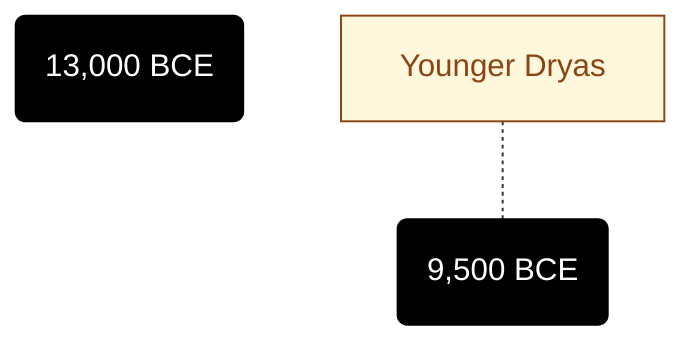

```mermaid
flowchart TD
  %%classDef When height:90px, valign:top, fill:black, color:white, stroke:black, font-family:verdana, font-size:12pt, padding:0px;
  %%classDef What fill:cornsilk, stroke:saddlebrown, color:saddlebrown, font-family:verdana, text-align:left, margin:8px;
  classDef When fill:black, color:white, stroke:black;
  classDef What fill:cornsilk, stroke:saddlebrown, color:saddlebrown, text-align:left;

  13000("13,000 BCE")
  9500("9,500 BCE")
  YOUNGER_DRYAS["Younger Dryas"]

  class 9500,13000,10000 When;
  class YOUNGER_DRYAS What;

  YOUNGER_DRYAS-.-
  9500


```
