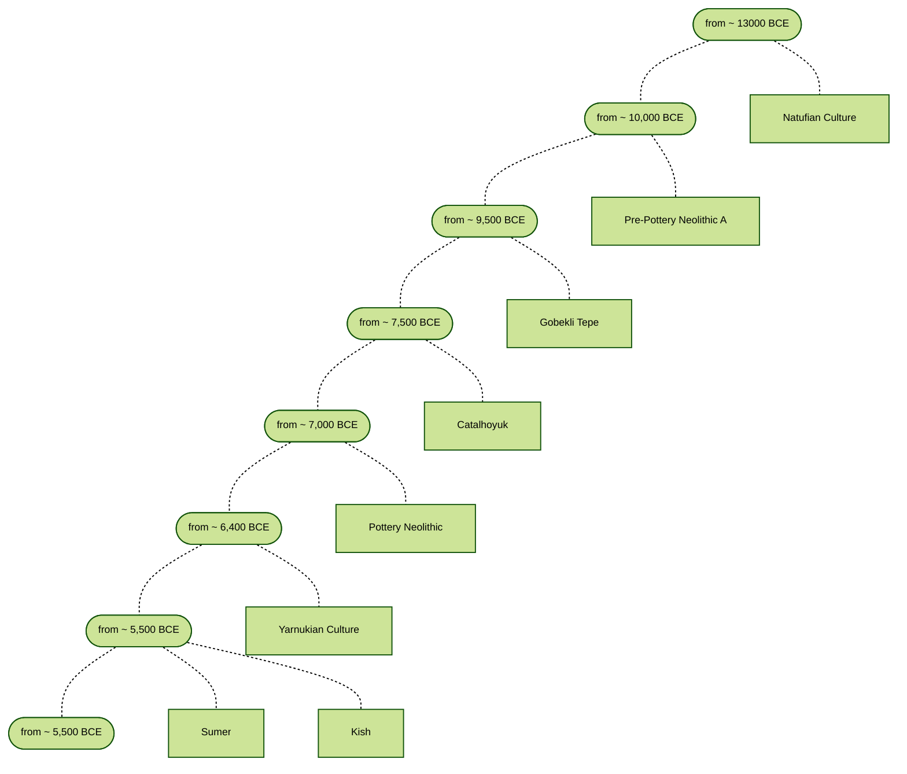

```mermaid
%%{init: { 'theme':'forest', 'themeVariables': { 'fontSize':'7pt' } }}%%
flowchart TD
    %% ========== ========== ========== ========== ==========
    13000([from ~ 13000 BCE])-.-
    10000([from ~ 10,000 BCE])-.-
    9500([from ~ 9,500 BCE])-.-
    7500([from ~ 7,500 BCE])-.-
    7000([from ~ 7,000 BCE])-.-
    6400([from ~ 6,400 BCE])-.-
    5500_SUMER([from ~ 5,500 BCE])-.-
    5500_KISH([from ~ 5,500 BCE])

    NATUFIAN[Natufian Culture]
    PRE_POTTERY_NEOLITHIC_A[Pre-Pottery Neolithic A]
    GOBEKLI_TEPE[Gobekli Tepe]
    CATALHOYUK[Catalhoyuk]
    POTTERY_NEOLITHIC[Pottery Neolithic]
    YARNUKIAN["Yarnukian Culture"]
    SUMER[Sumer]
    %%KISH[Kish]

    13000-.-NATUFIAN
    10000-.-PRE_POTTERY_NEOLITHIC_A
    9500-.-GOBEKLI_TEPE
    7500-.-CATALHOYUK
    7000-.-POTTERY_NEOLITHIC
    6400-.-YARNUKIAN
    5500_SUMER-.-SUMER[Sumer]
    5500_SUMER-.-KISH[Kish]
```
