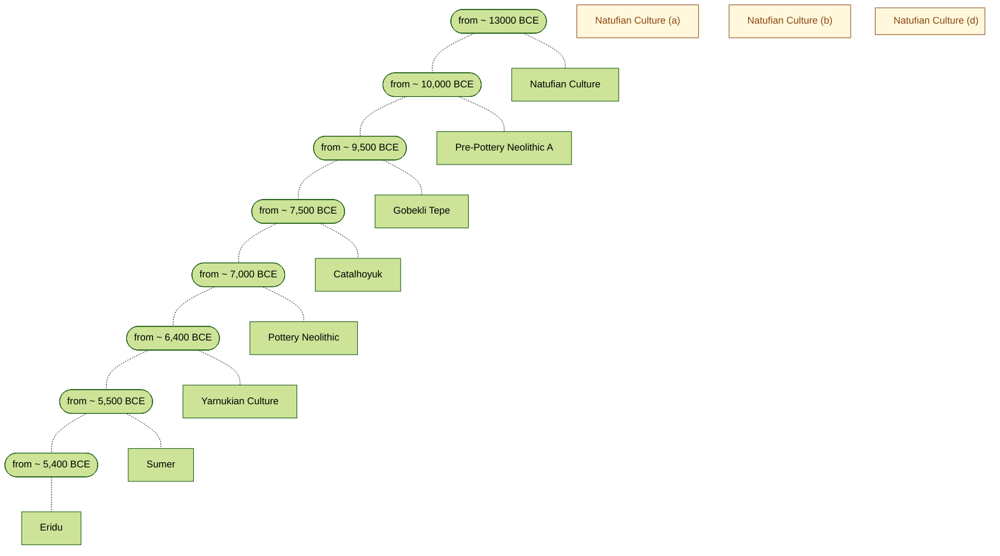

```mermaid
%%{init: { 'theme':'forest', 'themeVariables': { 'fontSize':'12pt' } }}%%
flowchart TD
      %%classDef Note fill:cornsilk, stroke:saddlebrown, color:saddlebrown, font-family:verdana, text-align:left, line-height:50%, margin:0px;

    classDef Note_a fill:cornsilk, stroke:saddlebrown, color:saddlebrown;
    classDef Note_b fill:cornsilk, stroke:saddlebrown, color:saddlebrown, margin:0px, padding:0px;
    classDef Note_c fill:cornsilk, stroke:saddlebrown, color:saddlebrown, height:40px, margin:0px, padding:0px;
    classDef Note_d fill:cornsilk, stroke:saddlebrown, color:saddlebrown, justify:left, height:44px, width:180px, margin:0px, padding:0px, line-height:90%;
    %% ========== ========== ========== ========== ==========
    13000([from ~ 13000 BCE])-.-
    10000([from ~ 10,000 BCE])-.-
    9500([from ~ 9,500 BCE])-.-
    7500([from ~ 7,500 BCE])-.-
    7000([from ~ 7,000 BCE])-.-
    6400([from ~ 6,400 BCE])-.-
    5500([from ~ 5,500 BCE])-.-
    5400([from ~ 5,400 BCE])

    NATUFIAN_a["Natufian Culture (a)"]:::Note_a
    NATUFIAN_b["Natufian Culture (b)"]:::Note_b
    %%NATUFIAN_c["Natufian Culture (c)"]:::Note_c
    NATUFIAN_d["Natufian Culture (d)"]:::Note_d

    NATUFIAN[Natufian Culture]
    PRE_POTTERY_NEOLITHIC_A[Pre-Pottery Neolithic A]
    GOBEKLI_TEPE[Gobekli Tepe]
    CATALHOYUK[Catalhoyuk]
    POTTERY_NEOLITHIC[Pottery Neolithic]
    YARNUKIAN["Yarnukian Culture"]
    SUMER[Sumer]
    ERIDU[Eridu]

    13000-.-NATUFIAN
    10000-.-PRE_POTTERY_NEOLITHIC_A
    9500-.-GOBEKLI_TEPE
    7500-.-CATALHOYUK
    7000-.-POTTERY_NEOLITHIC
    6400-.-YARNUKIAN
    5500-.-SUMER
    5400-.-ERIDU
```
