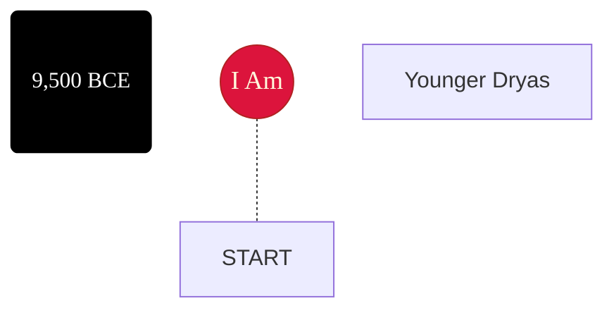

```mermaid
flowchart TD
  classDef Start fill:crimson, color:cornsilk, stroke:firebrick, font-family:verdana, font-size:14pt, padding:10px;
  classDef When fill:black, color:white, stroke:black, font-family:verdana, font-size:12pt, padding:10px;
  classDef What fill:cornsilk, stroke:saddlebrown, color:saddlebrown, font-family:verdana, text-align:left, margin:8px;

  class 9500,10000 When;
  class YOUNGER_DRYAS Start;

  %% ========== ========== ========== ========== ==========
  I_AM(("I Am")):::Start
  I_AM-.-START

  9500("9,500 BCE"):::When
  YOUNGER_DRYAS["Younger Dryas"]

```
