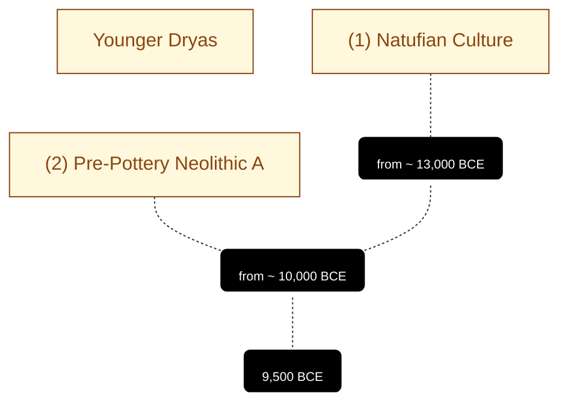

```mermaid
flowchart TD
  %%classDef When height:90px, valign:top, fill:black, color:white, stroke:black, font-family:verdana, font-size:12pt, padding:0px;
  %%classDef What fill:cornsilk, stroke:saddlebrown, color:saddlebrown, font-family:verdana, text-align:left, margin:8px;

  classDef When fill:black, color:white, stroke:black, font-size:8pt, height:35px, padding:0px, margin:0px;
  classDef What fill:cornsilk, stroke:saddlebrown, color:saddlebrown, text-align:left;

  13000("from ~ 13,000 BCE")
  10000("from ~ 10,000 BCE")
  9500("9,500 BCE")

  YOUNGER_DRYAS["Younger Dryas"]
  NATUFIAN["(1) Natufian Culture"]
  PPNA["(2) Pre-Pottery Neolithic A"]

  class YOUNGER_DRYAS,NATUFIAN,PPNA What;
  class 9500,10000,13000,10000 When;


  YOUNGER_DRYAS

  NATUFIAN-.-13000
  PPNA-.-10000

  13000-.-
  10000-.-
  9500


```
