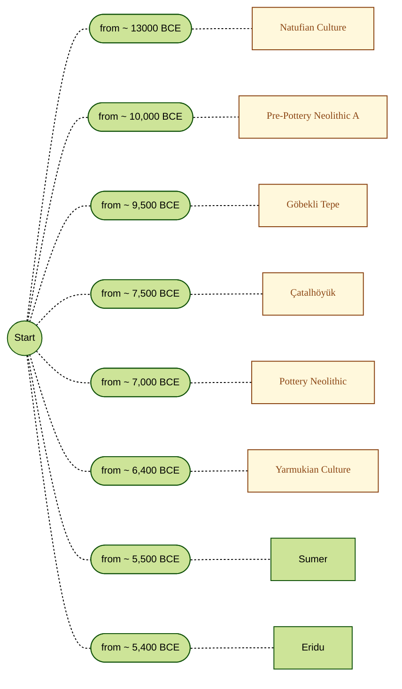

```mermaid
%%{init: { 'theme':'forest', 'themeVariables': { 'fontSize':'8pt' } }}%%
flowchart LR
classDef Note fill:cornsilk, stroke:saddlebrown, color:saddlebrown, font-family:verdana, text-align:left, line-height:150%, margin:0px, padding:0px;
classDef Note_b fill:cornsilk, stroke:saddlebrown, color:saddlebrown, font-family:verdana, text-align:left, margin:0px, padding:0px, height:40px;
      START(("Start"))

      13000([from ~ 13000 BCE])
      NATUFIAN[Natufian Culture]
      click NATUFIAN "https://en.wikipedia.org/wiki/Natufian_culture" _blank

      10000([from ~ 10,000 BCE])
      PRE_POTTERY_NEOLITHIC_A[Pre-Pottery Neolithic A]
      click PRE_POTTERY_NEOLITHIC_A "https://en.wikipedia.org/wiki/Pre-Pottery_Neolithic_A" _blank

      9500([from ~ 9,500 BCE])
      GOBEKLI_TEPE[Göbekli Tepe]
      click GOBEKLI_TEPE "https://en.wikipedia.org/wiki/Göbekli_Tepe" _blank

      7500([from ~ 7,500 BCE])
      CATALHOYUK[Çatalhöyük]
      click CATALHOYUK "https://en.wikipedia.org/wiki/Çatalhöyük" _blank

      7000([from ~ 7,000 BCE])
      POTTERY_NEOLITHIC[Pottery Neolithic]

      6400([from ~ 6,400 BCE])
      YARNUKIAN[Yarmukian Culture]
      click YARNUKIAN "https://en.wikipedia.org/wiki/Yarmukian_culture" _blank

      5500([from ~ 5,500 BCE])
      SUMER[Sumer]
      click SUMER "https://en.wikipedia.org/wiki/Sumer" _blank

      5400([from ~ 5,400 BCE])
      ERIDU[Eridu]
      click ERIDU "https://en.wikipedia.org/wiki/Eridu" _blank


      class NATUFIAN,PRE_POTTERY_NEOLITHIC_A,GOBEKLI_TEPE,CATALHOYUK,POTTERY_NEOLITHIC,YARNUKIAN Note;

      %% ========== ========== ========== ========== ==========
      START-.-13000-.-NATUFIAN
      START-.-10000-.-PRE_POTTERY_NEOLITHIC_A
      START-.-9500-.-GOBEKLI_TEPE
      START-.-7500-.-CATALHOYUK
      START-.-7000-.-POTTERY_NEOLITHIC
      START-.-6400-.-YARNUKIAN
      START-.-5500-.-SUMER
      START-.-5400-.-ERIDU
     
      
```
