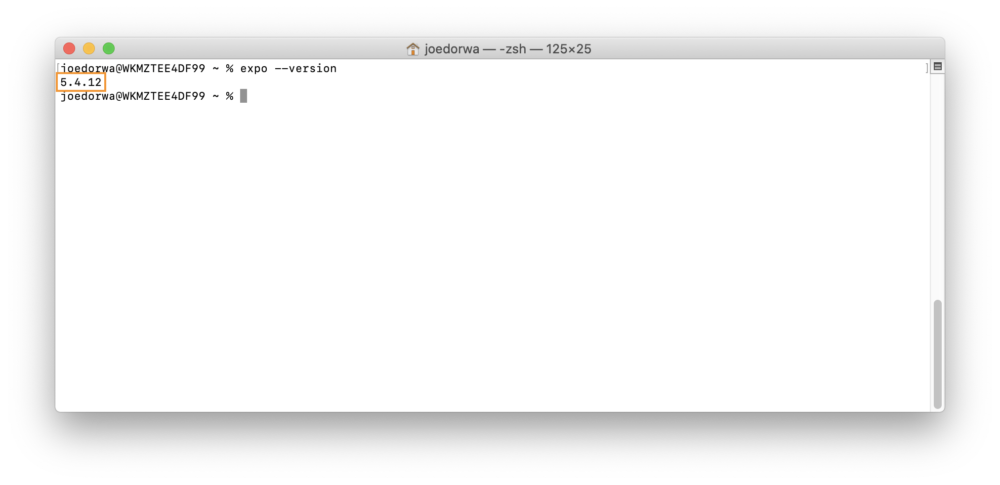

### Do I have Expo CLI installed?
Within your '~' (home) directory:
1. At the **Terminal prompt** - type ``expo --version``
2. Press the **Enter** key - if the Terminal responds with a number in the form: ``xx.xx.xx`` - Expo CLI is installed

### Install Expo CLI
Within your '~' (home) directory:
1. At the **Terminal prompt** - type ``yarn global add expo-cli``
2. Press the **Enter** key - Expo CLI will be installed
