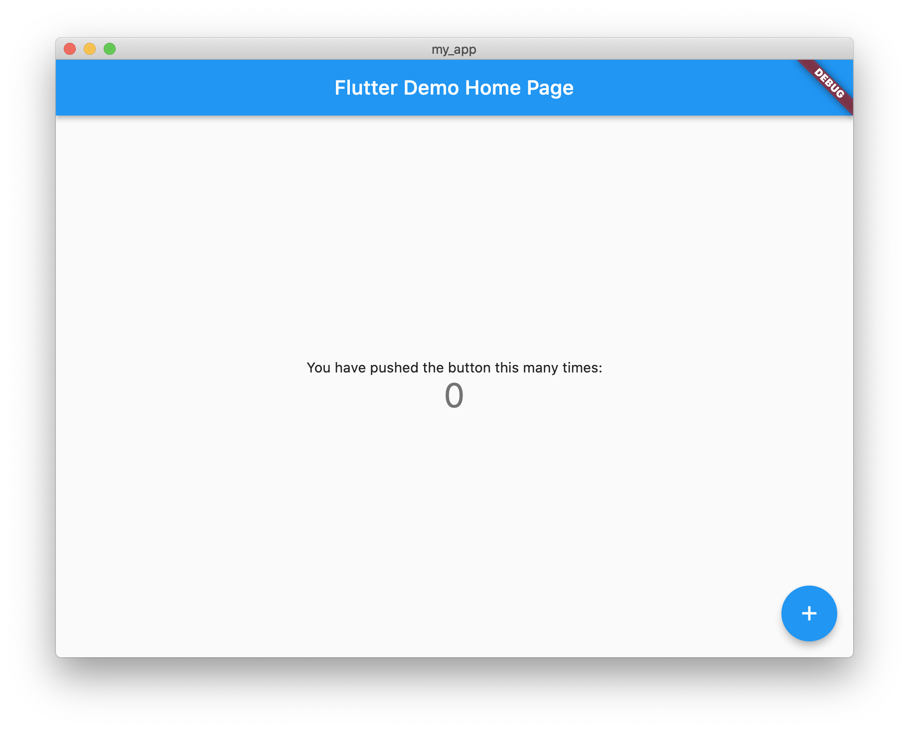
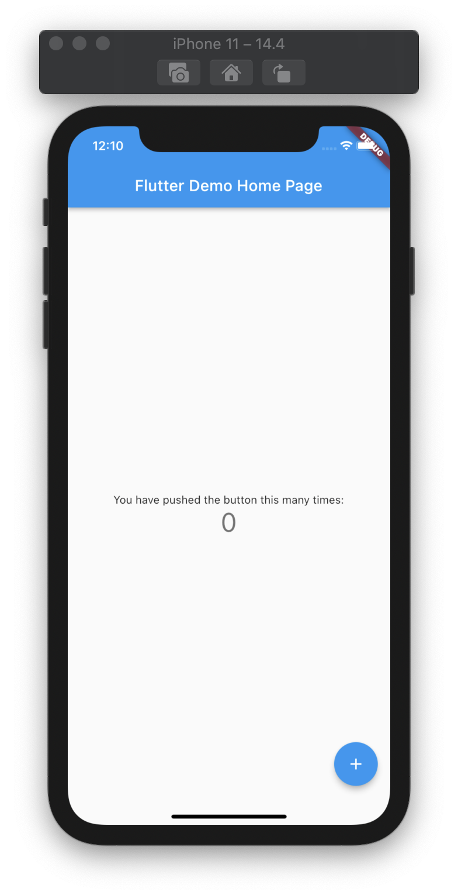

<a href="https://en.wikipedia.org/wiki/Flutter_(software)" target="_blank">**Flutter**</a> is an open source framework for building natively-compiled, multi-platform mobile-applications from a single codebase.

## Pre-requisites
These instructions presume that you have:
* Installed Xcode - <a href="../xcode/installing_xcode.md" target="_blank">see how</a>
* Installed VS Code (or <a href="https://code.visualstudio.com/" target="_blank">get it</a> and do so now) with these extensions:
  * Dart
  * Flutter
* Z shell is your terminal shell
* A ``~/projects`` directory - if not, then mentally replace ``~/projects`` in the instructions with the name your own 'projects' directory

## Objectives
By the end of this process you will have:
* Installed the Flutter SDK
* Run the Flutter 'my_app' demonstration application in:
  * A macOS window
  * An iOS Simulator

## Step 1. - Install the Flutter SDK
1. Download the <a href="https://docs.flutter.dev/get-started/install/macos" target="_blank">Flutter SDK</a> for macOS
2. Move the download to ``~/projects``

If the download has unpacked itself, you will already have a ``~/projects/flutter/`` directory structure - otherwise - unzipping the download will create the ``~/projects/flutter/`` directory structure, and unpack the Flutter SDK into it.

## Step 2. - Edit your ``.zshrc`` file
Within your '~' (home) directory:
1. Edit your ``.zshrc`` file - adding:
<pre># Flutter
export PATH="$HOME/projects/flutter/bin:$PATH"</pre>
2. Save your ``.zshrc`` file
3. Open a Terminal window
4. At the Terminal prompt - type ``flutter --version``
5. Press the **Enter** key - the Terminal should respond (with something like):
<pre>Flutter 3.0.0 • channel stable • https://github.com/flutter/flutter.git
Framework • revision ee4e09cce0 (7 weeks ago) • 2022-05-09 16:45:18 -0700
Engine • revision d1b9a6938a
Tools • Dart 2.17.0 • DevTools 2.12.2</pre>

## Step 3. - Run Flutter Doctor
1. At the Terminal prompt - type ``flutter doctor``
2. Press the **Enter** key - the Terminal should respond (with something like):
<pre>Doctor summary (to see all details, run flutter doctor -v):
[✓] Flutter (Channel stable, 3.0.0, on Mac OS X 10.15.7 19H1922 darwin-x64, locale en-GB)
[✗] Android toolchain - develop for Android devices
    ✗ Unable to locate Android SDK.
      Install Android Studio from: https://developer.android.com/studio/index.html
      On first launch it will assist you in installing the Android SDK components.
      (or visit https://flutter.dev/docs/get-started/install/macos#android-setup for detailed instructions).
      If the Android SDK has been installed to a custom location, please use
      `flutter config --android-sdk` to update to that location.

[!] Xcode - develop for iOS and macOS (Xcode 12.4)
    ✗ Flutter requires Xcode 13 or higher.
      Download the latest version or update via the Mac App Store.
    ✗ CocoaPods not installed.
        CocoaPods is used to retrieve the iOS and macOS platform side's plugin code that responds to your plugin usage on the
        Dart side.
        Without CocoaPods, plugins will not work on iOS or macOS.
        For more info, see https://flutter.dev/platform-plugins
      To install see https://guides.cocoapods.org/using/getting-started.html#installation for instructions.
[✗] Chrome - develop for the web (Cannot find Chrome executable at /Applications/Google Chrome.app/Contents/MacOS/Google
    Chrome)
    ! Cannot find Chrome. Try setting CHROME_EXECUTABLE to a Chrome executable.
[!] Android Studio (not installed)
[✓] VS Code (version 1.67.2)
[✓] Connected device (1 available)
[✓] HTTP Host Availability</pre>

## Step 4. - Copy the Flutter 'my_app' demonstration application
Within the ``~/projects`` directory:
1. At the Terminal prompt - type ``flutter create my_app``
2. Press the **Enter** key - the Terminal should respond:
<pre>Creating project my_app...
Running "flutter pub get" in my_app...                           1,538ms
Wrote 127 files.

All done!
In order to run your application, type:

  $ cd my_app
  $ flutter run

Your application code is in my_app/lib/main.dart.</pre>

**Note:**
* That a ``my_app`` sub-directory has been added to ``~/projects``
* That a ``lib`` sub-directory has been added to ``~/projects/my_app``
* That a ``main.dart`` file has been added to ``~/projects/my_app/lib`` - this is the Flutter 'my_app' main program file

## Step 5. - Run the Flutter 'my_app' demonstration application in a macOS window

1. At the Terminal prompt - type ``cd my_app``
2. Press the **Enter** key - the directory will be changed to the ``my_app`` directory
3. At the Terminal prompt - type ``flutter run``
4. Press the **Enter** key - the Flutter 'my_app' demonstration application will launch in a macOS window
5. Click the big '+' a few times to see the counter increment.
6. Quit the macOS window

## Step 6. - Run the Flutter 'my_app' demonstration application in an iOS Simulator

**THESE VS CODE STEPS SEEMS NECESSARY BUT I'VE NO IDEA WHY**

1. Open VS Code
2. In the **File** menu - select the **Open Folder...** option - a navigation dialog opens
4. Click the 'projects' folder
5. Click the 'my_app' folder
6. Click the **Open** button - the Flutter 'my_app' demonstration project opens in the project Explorer panel
7. Right-click the **ios** sub-folder
8. Select the **Open in Xcode** option - Xcode opens 
9. Click the **Runner** button
10. Select the **iPhone 11** option
11. Click the **Build and run** button - the Flutter 'my_app' demonstration application is launched in the iOS Simulator
12. Click the big '+' a few times to see the counter increment.
13. Quit the iOS Simulator

