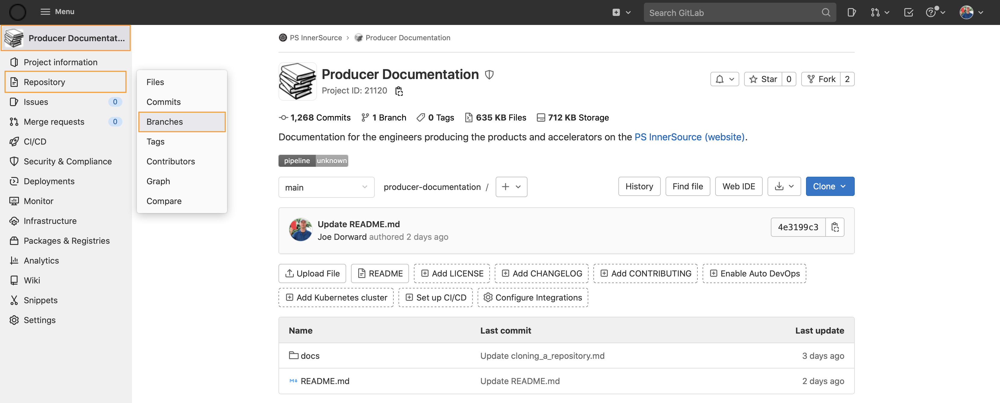
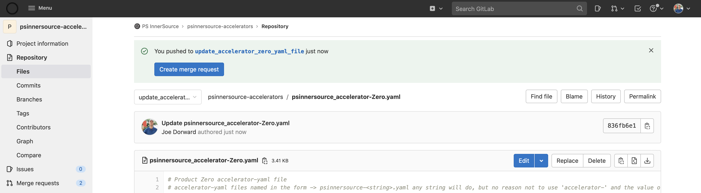

### Create branch
Within a repository:
1. Click **Repository** > **Branches** - the Branches page opens

2. Click the **New branch** button
3. Name the branch - for example 'updating ... accelerator-yaml file'
4. Click the **Create branch** button - the branch is crerated

### Make changes
1. Click the **Edit** button
2. Make changes
3. Click the **Commit changes** button

### Create merge request
1. Click the **Create merge request** button
2. Click the **Create merge request** button
3. Click the **Merge** button - done
