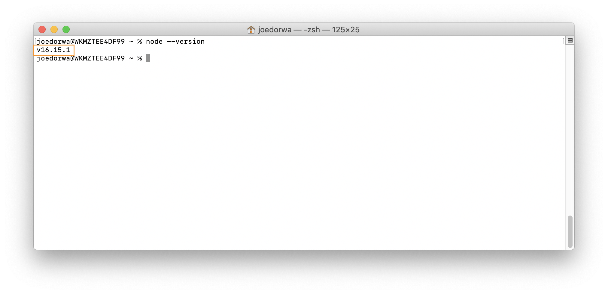

### Do I have Node.js installed?
Within your '~' (home) directory:
1. At the **Terminal prompt** - type ``node --version``
2. Press the **Enter** key - if the Terminal responds with a number in the form: ``vxx.xx.xx`` - Node.js is installed

### Install Node.js
Within your '~' (home) directory:
1. At the **Terminal prompt** - type ``nvm install --lts``
2. Press the **Enter** key - Node.js will be installed
3. At the **Terminal prompt** - type ``source "$HOME/.zshrc"``
