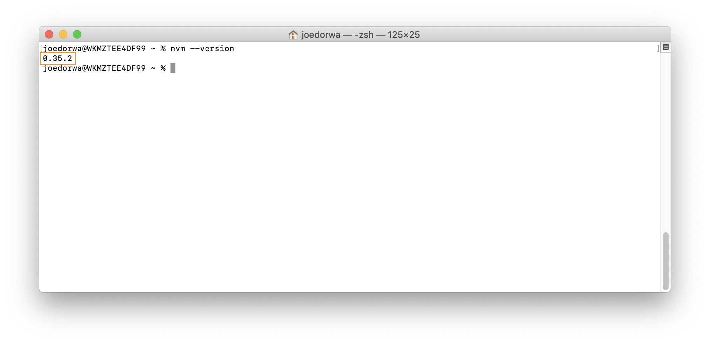

### Do I have nvm installed?
Within your '~' (home) directory:
1. At the Terminal prompt - type ``nvm --version``
2. Press the **Enter** key - if the Terminal responds with a number in the form: ``xx.xx.xx`` - nvm is installed

### Install nvm
Within your '~' (home) directory:
1. At the **Terminal prompt** - type ``curl -o- https://raw.githubusercontent.com/nvm-sh/nvm/v0.35.2/install.sh | bash``
2. Press the **Enter** key - nvm will be installed
