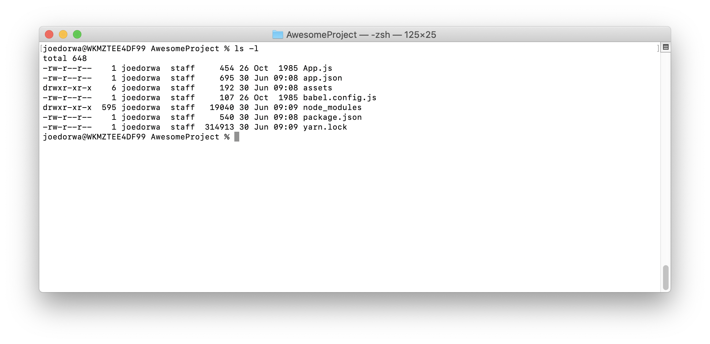
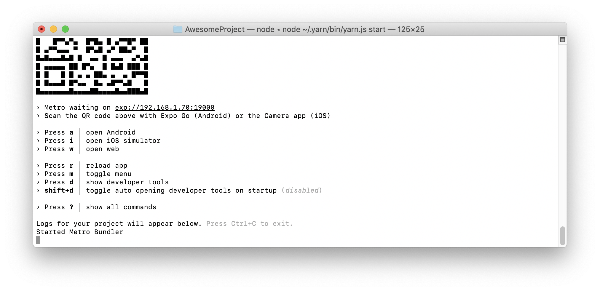
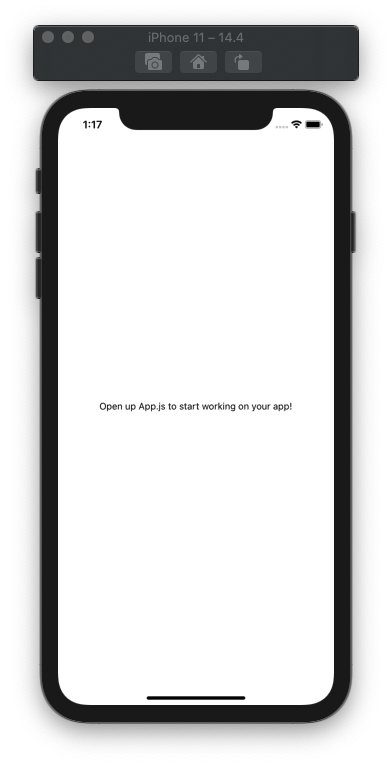
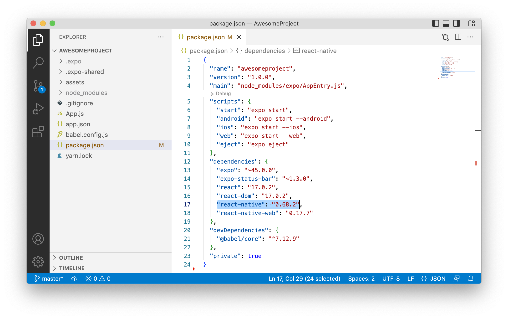

<a href="https://en.wikipedia.org/wiki/React_Native" target="_blank">**React Native**</a> is an open source framework for building natively-compiled, multi-platform mobile-applications from a single codebase.

## Pre-requisites
These instructions presume that you have:
* Installed Xcode - <a href="../xcode/installing_xcode.md" target="_blank">see how</a>
* Installed VS Code (or <a href="https://code.visualstudio.com/" target="_blank">get it</a> and do so now)
* Installed nvm - <a href="../nvm/installing_nvm.md" target="_blank">see how</a>
* Installed Node.js - <a href="../node_js/installing_node_js.md" target="_blank">see how</a>
* Installed Expo CLI - <a href="../expo_cli/installing_expo_cli.md" target="_blank">see how</a>
* Z shell is your terminal shell
* A ``~/projects`` directory - if not, then mentally replace ``~/projects`` in the instructions with the name your own 'projects' directory

## Objectives
By the end of this process you will have:
* Create the React Native 'AwesomeProject' demonstration application
* Run the React Native 'AwesomeProject' demonstration application
* Confirmed the version of React Native that you are using

## Step 1. - Create the React Native 'AwesomeProject' demonstration application
Within your '~' (home) directory:
1. At the Terminal prompt - type ``cd projects``
2. Press the **Enter** key - the current directory will be changed to ``projects``

### Add ``~/projects/react_native``
1. At the Terminal prompt - type ``mkdir react_native``
2. Press the **Enter** key - the ``react_native`` sub-directory will be created
3. At the Terminal prompt - type ``cd react_native``
4. Press the **Enter** key - the current directory will be changed to ``react_native``

### Add ``~/projects/react_native/demos``
1. At the Terminal prompt - type ``mkdir demos``
2. Press the **Enter** key - the ``demos`` sub-directory will be created
3. At the Terminal prompt - type ``cd demos``
4. Press the **Enter** key - the current directory will be changed to ``demos``

### Create ``~/projects/react_native/demos/AwesomeProject``
1. At the Terminal prompt - type ``expo init AwesomeProject``
2. Press the **Enter** key - the ``AwesomeProject`` sub-directory will be created - it contains your first React Native demo-application
3. At the Terminal prompt - type ``cd AwesomeProject``
4. Press the **Enter** key - the current directory will be changed to ``AwesomeProject``
5. At the Terminal prompt - type ``ls -l``
6. Press the **Enter** key - the contents of the ``AwesomeProject`` sub-directory will be shown

## Step 2. - Run the React Native 'AwesomeProject' demonstration application
1. At the Terminal prompt - type ``yarn start``
2. Press the **Enter** key

3. At the Terminal prompt - type ``i`` - the Metro Bundler (server) is started and the 'AwesomeProject' demonstration application is launched in the iOS Simulator

4. Click the Terminal window
5. Press the **Ctrl**+**c** keys - the Metro Bundler (server) will stop
6. Close the iOS Simulator

## Step 3. - Confirm the version of React Native that you are using
1. Open VS Code
2. In the **File** menu - select the **Open Folder...** option - a navigation dialog opens
3. Click the 'projects' folder
4. Click the 'react_native' folder
5. Click the 'demos' folder
6. Click the 'AwesomeProject' folder
5. Click the **Open** button - the 'AwesomeProject' demonstration project opens in the project Explorer panel
6. Expand the 'AwesomeProject' sub-structure
7. Click the ``package.json`` file - it opens and under the ``dependencies`` key you will see the sub-key ``react-native`` - its value is the version in the form ``xx.xx.xx``

