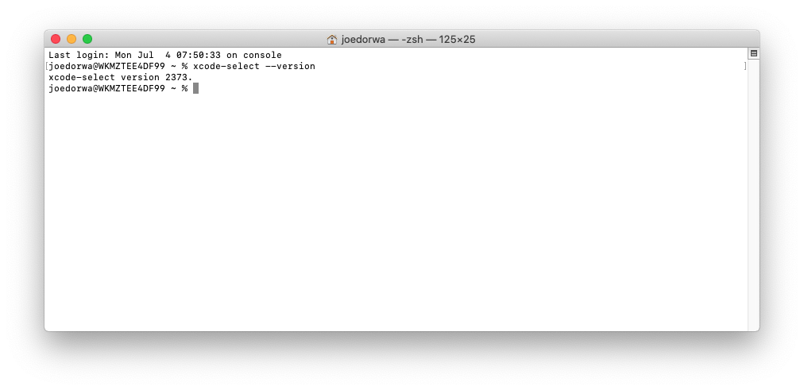

### Do I have Xcode command-line tools installed?
Within your '~' (home) directory:
1. At the Terminal prompt - type ``xcode-select --version``
2. Press the **Enter** key - if the Terminal responds with a number in the form: ``xxxx`` - the Xcode command-line tools are installed

### Install Xcode command-line tools
Within your '~' (home) directory:
1. At the Terminal prompt - type ``xcode-select --install``
2. Press the **Enter** key
3. Click the **Install** button (when prompted)
4. Click the **Agree** button (when prompted) - the command-line tools will be downloaded and installed (~2 minutes)
5. Click the **Done** button (when prompted)
