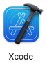

These instructions presume that you have an **Apple ID** - get one (before continuing) from: https://appleid.apple.com/account

### Installation
1. Download Xcode - https://developer.apple.com/xcode/
3. Move the Xcode download to the ``~/Applications`` directory
4. Run the Xcode installer - Xcode becomes an installed application

### Configuration
1. At the Terminal prompt - type ``sudo xcode-select --switch /Applications/Xcode.app/Contents/Developer``
2. Press the **Enter** key
3. At the Terminal prompt - type ``sudo xcodebuild -runFirstLaunch``
4. Press the **Enter** key
5. At the Terminal prompt - type ``sudo xcodebuild -license``
6. Press the **Enter** key
7. Scroll to the bottom of the agreement
8. At the 'agreement prompt' ``By typing 'agree' you are agreeing to the terms of the software license agreements. Type 'print' to print them or anything else to cancel, [agree, print, cancel]`` - type ``agree``
9. Press the **Enter** key
