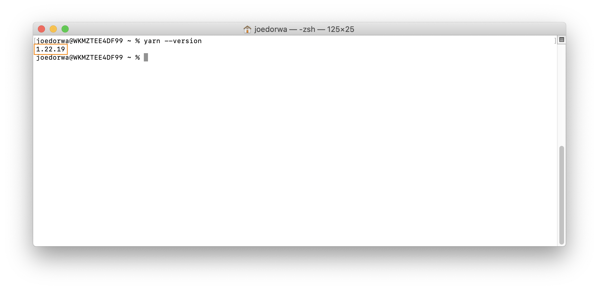

### Do I have yarn installed?
Within your '~' (home) directory:
1. At the **Terminal prompt** - type ``yarn --version``
2. Press the **Enter** key - if the Terminal responds with a number in the form: ``xx.xx.xx`` - yarn is installed

### Install yarn
Within your '~' (home) directory:
1. At the **Terminal prompt** - type ``curl -o- -L https://yarnpkg.com/install.sh | bash``
2. Press the **Enter** key - yarn will be installed
3. At the **Terminal prompt** - type ``source "$HOME/.zshrc"``
