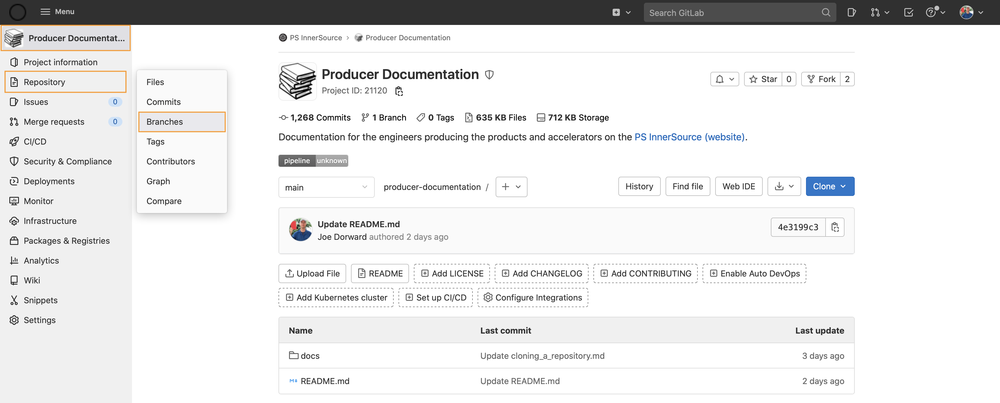

### Create branch
Within a repository:
1. Click **Repository** > **Branches** - the Branches page opens

2. Click the **New branch** button
3. Name the branch - for example 'updating ... accelerator-yaml file'
4. Click the **Create branch** button - the branch is crerated

### Make changes

### Create merge request

