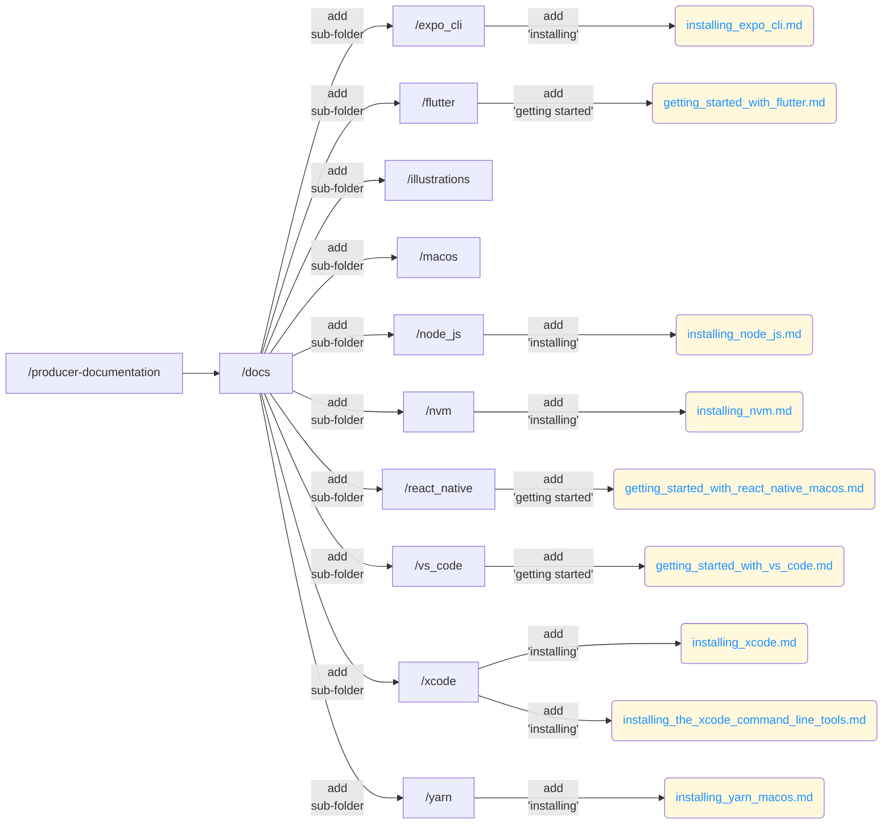

```mermaid
  flowchart LR
    PD["/producer-documentation"]
    click PD "../" _blank

    DOCS["/docs"]
    click DOCS "." _blank

    EXPO_CLI["/expo_cli"]
      click EXPO_CLI "./expo_cli" _blank
      EXPO_CLI_I("installing_expo_cli.md")
      style EXPO_CLI_I fill:cornsilk,color:dodgerblue

    FLUTTER["/flutter"]
      click FLUTTER "./flutter" _blank
      GSW_F("getting_started_with_flutter.md")
      style GSW_F fill:cornsilk,color:dodgerblue

      %%F_IM["installing_flutter_macos.md"]
      %%F_DEMO["run_flutter_demo_macos.md"]
      %%style F_IM fill:cornsilk,color:dodgerblue
      %%style F_DEMO fill:cornsilk,color:dodgerblue

    ILLUSTRATIONS["/illustrations"]
      click ILLUSTRATIONS "./illustrations" _blank

    MACOS["/macos"]
      click MACOS "./macos" _blank

    NODE_JS["/node_js"]
      click NODE_JS "./node_js" _blank
      NODE_JS_I("installing_node_js.md")
      style NODE_JS_I fill:cornsilk,color:dodgerblue

    NVM["/nvm"]
      click NVM "./nvm" _blank
      NVM_I("installing_nvm.md")
      style NVM_I fill:cornsilk,color:dodgerblue

    REACT_NATIVE["/react_native"]
      click REACT_NATIVE "./react_native" _blank
      GSW_RN("getting_started_with_react_native_macos.md")
      style GSW_RN fill:cornsilk,color:dodgerblue

    VS_CODE["/vs_code"]
      click VS_CODE "./vs_code" _blank
      GSW_VS_CODE("getting_started_with_vs_code.md")
      style GSW_VS_CODE fill:cornsilk,color:dodgerblue

    XCODE["/xcode"]
      click XCODE "./xcode" _blank
      XCODE_I("installing_xcode.md")
      style XCODE_I fill:cornsilk,color:dodgerblue

      XCODE_CLT_I("installing_the_xcode_command_line_tools.md")
      style XCODE_CLT_I fill:cornsilk,color:dodgerblue

    YARN["/yarn"]
      click YARN "./yarn" _blank
      YARN_I("installing_yarn_macos.md")
      style YARN_I fill:cornsilk,color:dodgerblue

    PD-->DOCS

    DOCS-- add<br/>sub-folder -->EXPO_CLI
      EXPO_CLI-- add<br/>'installing' -->EXPO_CLI_I

    DOCS-- add<br/>sub-folder -->FLUTTER
      FLUTTER-- add<br/>'getting started' -->GSW_F
      %%FLUTTER-- add<br/>'installing' -->F_IM %% install macos
      %%FLUTTER-- add<br/>'run demo' -->F_DEMO

    DOCS-- add<br/>sub-folder -->ILLUSTRATIONS

    DOCS-- add<br/>sub-folder -->MACOS

    DOCS-- add<br/>sub-folder -->NODE_JS-- add<br/>'installing' -->NODE_JS_I
    DOCS-- add<br/>sub-folder -->NVM-- add<br/>'installing' -->NVM_I

    DOCS-- add<br/>sub-folder -->REACT_NATIVE
      REACT_NATIVE-- add<br/>'getting started' -->GSW_RN

    DOCS-- add<br/>sub-folder -->VS_CODE
      VS_CODE-- add<br/>'getting started' -->GSW_VS_CODE

    DOCS-- add<br/>sub-folder -->XCODE-- add<br/>'installing' -->XCODE_I
      XCODE-- add<br/>'installing' -->XCODE_CLT_I

    DOCS-- add<br/>sub-folder -->YARN-- add<br/>'installing' -->YARN_I
```
