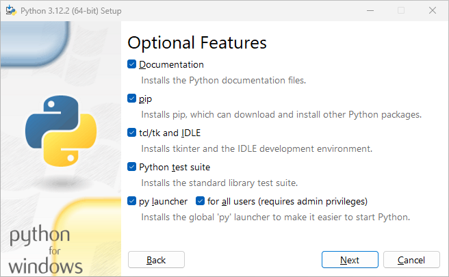

## Do I have Python installed?

1. At the **Terminal prompt** - type `python --version`
2. Press the **Enter key** - if the Terminal responds with a number in the form: `xx.xx.xx` - Python is installed

## Install Python
1. Download Python - from <a href="https://www.python.org/downloads/" target="_blank">here</a>
2. Once downloaded - right-click the installer, and select **Run as administrator**
3. On the **Optional** Features page - ensure that the **pip** checkbox is checked

