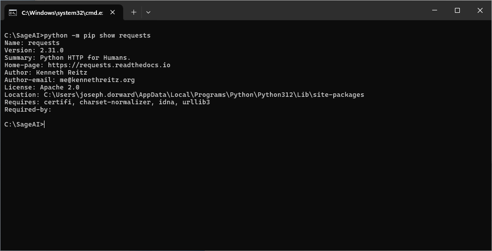

## Do I have `requests` installed?

1. At the **Terminal prompt** - type `python -m pip show requests`
2. Press the **Enter key** - if the Terminal responds in the form as shown below - `requests` is installed

## Install `requests`
1. At the **Terminal prompt** - type `python -m pip install requests`
2. Repeat the check (above)
