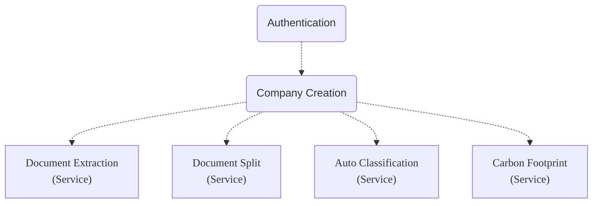

Since the Authentication step will be performed by all applications using (what we call)
the Sage Ai Services, it is not (strictly speaking) part of the Document Extraction service.



In the Authentication 'success' response (below), the units of the `expires_in` value is
seconds.
The implication of that fact is, that your applications must repeat the authentication
step every eight hours.

```json:response
The `response.status_code` is: 200
{
    "access_token": "[REDACTED]",
    "scope": "notify",
    "expires_in": 28800,
    "token_type": "Bearer"
}
```

When your application authenticates, it is expected that it will (a) cache the
Authentication Token, (b) 'take note' of the `expires_in` value, (c) 'take note'
of the authentication date-time, and (d) do simple date-time arithmetic to check
the difference between 'then' and 'now' (re-authenticating when needed) before
making endpoint calls.

If your application calls an endpoint after your Authentication Token expires, it will
get the 'token_expired' response (below).

```json:response
The `response.status_code` is: 401
{
    "detail": {
        "code": "token_expired",
        "description": "Not authenticated. Token has expired."
    }
}
```
