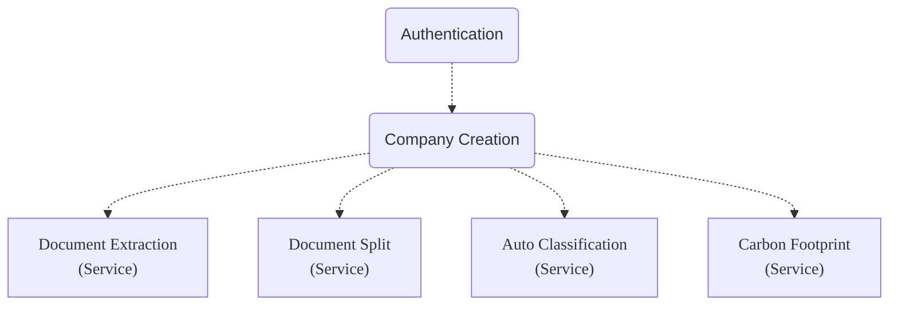

Since the Company Creation step will be performed by all applications using (what we call)
the Sage Ai Services, it is not (strictly speaking) part of the Document Extraction service.



Your Sage Ai applications must carry out the Company Creation step, once for each Company for whom
your application will be uploading scanned or photographed documents.

In the Company Creation 'success' response (below), the endpoint responds with a 'unique
Company identifier' value. Your application must store this 'unique Company identifier' value
for future endpoint calls.

```json:response
The `response.status_code` is: 200
{
    "customer_unique_id": "9b444ce1-e156-470b-8b49-8e6ff4d6f124"
}
```
