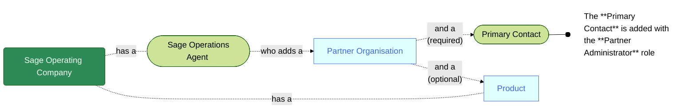

```mermaid
%%{
  init: {
    'theme': 'forest',
    'themeVariables': {
      'fontSize':'14pt'
    }
  }
}%%
flowchart LR
  classDef Sage fill:seagreen, color:honeydew;
  classDef Noun fill:lightcyan, stroke:royalblue, color:royalblue;
  classDef Note fill:white, stroke:white, text-align:left;

  SAGE_OPERATING_COMPANY_01(Sage Operating Company)-.has a.-
  SAGE_OPERATIONS_AGENT_01([&nbsp;Sage Operations Agent&nbsp;])-.who adds a.->
  PARTNER_ORGANISATION_01[Partner Organisation]-.and a<br/>(required).->
  PRIMARY_CONTACT_01([&nbsp;Primary Contact&nbsp;])--o
  PRIMARY_CONTACT_01_NOTE[The **Primary Contact** is added with the **Partner Administrator** role]

  SAGE_OPERATING_COMPANY_01-.has a.-
  PRODUCT_01[Product]

  PARTNER_ORGANISATION_01-.and a<br/>(optional).->
  PRODUCT_01

  class SAGE_OPERATING_COMPANY_01 Sage
  class PARTNER_ORGANISATION_01,PRODUCT_01 Noun
  class PRIMARY_CONTACT_01_NOTE Note
```
