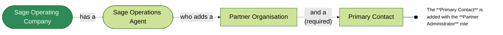

```mermaid
%%{
  init: {
    'theme': 'forest',
    'themeVariables': {
      'fontSize':'16pt'
    }
  }
}%%
flowchart LR
 %%classDef Note fill:pink, stroke:white, text-align:left, font-size:12pt, width:400px, margin:0px, padding:10px;
 classDef Sage fill:seagreen, color:honeydew;
 classDef Note fill:white, stroke:white, text-align:left, font-size:12pt;

  SAGE_OPERATING_COMPANY_01([Sage Operating Company])-.has a.-
  SAGE_OPERATIONS_AGENT_01([Sage Operations Agent])-.who adds a.->
  PARTNER_ORGANISATION_01[Partner Organisation]-.and a<br/>(required).->
  PRIMARY_CONTACT_01[Primary Contact]--o
  PRIMARY_CONTACT_01_NOTE[The **Primary Contact** is added with the **Partner Administrator** role]

  class SAGE_OPERATING_COMPANY_01 Sage
  class PRIMARY_CONTACT_01_NOTE Note
```
