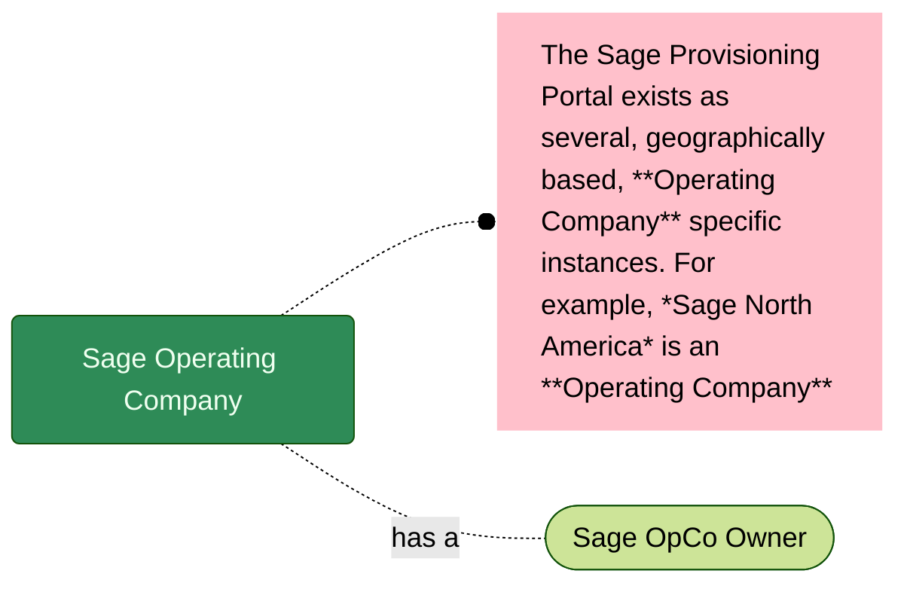

```mermaid
%%{
  init: {
    'theme': 'forest',
    'themeVariables': {
      'fontSize':'14pt'
    }
  }
}%%
flowchart LR
  classDef Sage fill:seagreen, color:honeydew;
  classDef Noun fill:lightcyan, stroke:royalblue, color:royalblue;
  classDef Note fill:pink, stroke:white, text-align:left;

  SAGE_OPERATING_COMPANY_01(Sage Operating Company)-.-o
  SAGE_OPERATING_COMPANY_01_Note[The Sage Provisioning Portal exists as several, geographically based, **Operating Company** specific instances. For example, *Sage North America* is an **Operating Company**]

  SAGE_OPERATING_COMPANY_01-.has a.-
  SAGE_OPCO_OWNER_01([&nbsp;Sage OpCo Owner&nbsp;])


  %%-.has a.-
  %%SAGE_OPERATIONS_AGENT_01([&nbsp;Sage Operations Agent&nbsp;])-.who adds a.->
  %%PARTNER_ORGANISATION_01[Partner Organisation]-.and a<br/>(required).->
  %%PRIMARY_CONTACT_01([&nbsp;Primary Contact&nbsp;])-.-o
  %%PRIMARY_CONTACT_01_NOTE[The **Primary Contact** is added with the **Partner Operations Agent** role]

  class SAGE_OPERATING_COMPANY_01 Sage
  class PARTNER_ORGANISATION_01,PRODUCT_01,PRODUCT_02 Noun
  class SAGE_OPERATING_COMPANY_01_Note Note
```
