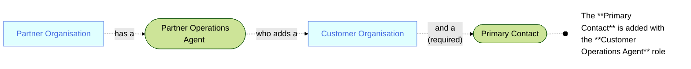

```mermaid
%%{
  init: {
    'theme': 'forest',
    'themeVariables': {
      'fontSize':'14pt'
    }
  }
}%%
flowchart LR
  classDef Sage fill:seagreen, color:honeydew;
  classDef Noun fill:lightcyan, stroke:royalblue, color:royalblue;
  classDef Note fill:white, stroke:white, text-align:left;

  PARTNER_ORGANISATION_01[Partner Organisation]-.has a.->
  PARTNER_OPERATIONS_AGENT_01([&nbsp;Partner Operations Agent&nbsp;])-.who adds a.->
  CUSTOMER_ORGANISATION_01[Customer Organisation]-.and a<br/>(required).->
  PRIMARY_CONTACT_01([&nbsp;Primary Contact&nbsp;])-.-o
  PRIMARY_CONTACT_01_NOTE[The **Primary Contact** is added with the **Customer Operations Agent** role]

  class PARTNER_ORGANISATION_01,CUSTOMER_ORGANISATION_01 Noun
  class PRIMARY_CONTACT_01_NOTE Note
```
