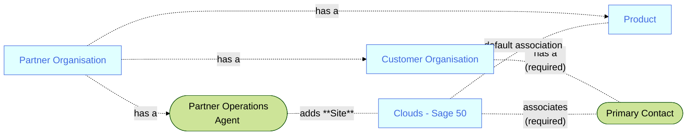

A user with **Partner Operations Agent** credentials:
1. Signs-in to the Sage Provisioning Portal  
2. Opens the **Customer** specific **CustomerDetails** page  
3. Opens the **Environment** tab
4. Clicks the **Add site** button and follows that process  

<MessageCard type='proactive' label='Note'>**Sites** are added to **Customer** organisations, so that association is made by default 

A **Partner** organisation *MAY* be added as a Sage **Business unit**, which is the type of **Partner** organisation for direct sales to **Customer** organisations. Otherwise, a **Partner** organisation will be added as a thrid-party re-seller of Sage **Products**  **Partner** organisations are tightly associated with **Operating Companies** - for example **Sage North America**  When **Partner** organisations are added, a **Primary Contact** *MUST* also be added for the **Partner** organisation  When **Partner** organisations are added, they *MAY* (optionally at that time) be associated with one-or-more **Products**</MessageCard>
