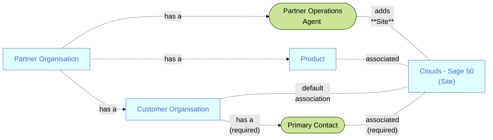

A user with **Partner Operations Agent** credentials:
1. Signs-in to the Sage Provisioning Portal  
2. Opens the **Customer** specific **CustomerDetails** page  
3. Opens the **Environment** tab
4. Clicks the **Add site** button and follows that process  

<MessageCard type='proactive' label='Note'>A **Partner Operations Agent** will add a **Site** to a **Customer** organisation, so that association is made by default  During the process of adding a **Site** it is associated with a **Product**, and a default administrative user</MessageCard>
