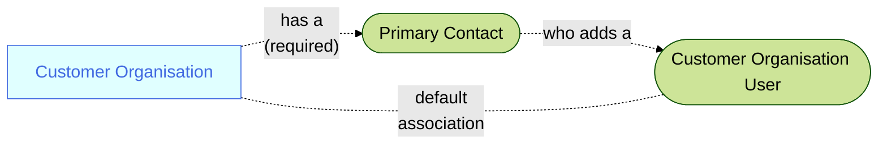

A user with **Customer Operations Agent** credentials:
1. Signs-in to the Sage Provisioning Portal  
2. Opens the **Customer** specific **CustomerDetails** page  
3. Opens the **Environment** tab
4. Clicks the **Add user** button and follows that process  

<MessageCard type='proactive' label='Note'>A **Customer Operations Agent** will add a user (by default) to the **Customer Organisation**</MessageCard>
