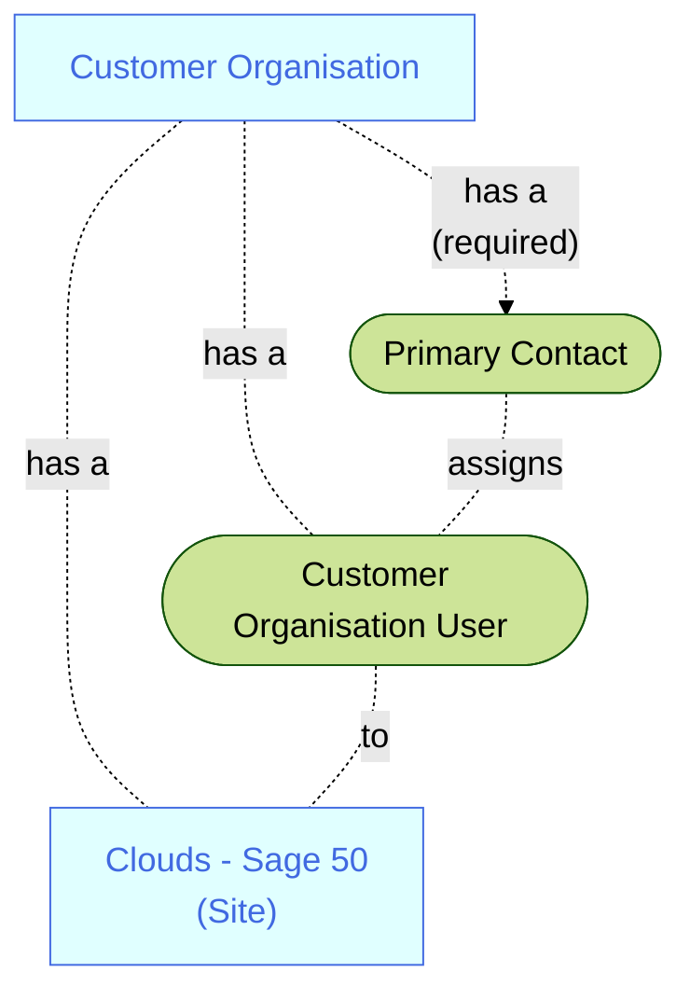

A user with **Customer Operations Agent** credentials:
1. Signs-in to the Sage Provisioning Portal  
2. Opens the **Site** specific **SiteDetails** page  
3. Opens the **Environment** tab
4. Clicks the **Assign user** button and follows that process  

