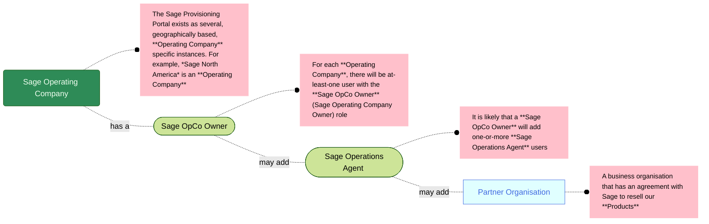

```mermaid
%%{
  init: {
    'theme': 'forest',
    'themeVariables': {
      'fontSize':'14pt'
    }
  }
}%%
flowchart LR
  classDef Sage fill:seagreen, color:honeydew;
  classDef Noun fill:lightcyan, stroke:royalblue, color:royalblue;
  classDef Note fill:pink, stroke:white, text-align:left, font-size: 95%;

  SAGE_OPERATING_COMPANY_01(Sage Operating Company)-.-o
  SAGE_OPERATING_COMPANY_01_Note[The Sage Provisioning Portal exists as several, geographically based, **Operating Company** specific instances. For example, *Sage North America* is an **Operating Company**]

  SAGE_OPERATING_COMPANY_01-.has a.-
  SAGE_OPCO_OWNER_01([&nbsp;Sage OpCo Owner&nbsp;])-.-o
  SAGE_OPCO_OWNER_01_NOTE["For each **Operating Company**, there will be at-least-one user with the **Sage OpCo Owner** (Sage Operating Company Owner) role"]

  SAGE_OPCO_OWNER_01-.may add.-
  SAGE_OPERATIONS_AGENT_01([&nbsp;Sage Operations Agent&nbsp;])-.-o
  SAGE_OPERATIONS_AGENT_01_NOTE[It is likely that a **Sage OpCo Owner** will add one-or-more **Sage Operations Agent** users]

  SAGE_OPERATIONS_AGENT_01-.may add.-
  PARTNER_ORGANISATION_01[&nbsp;Partner Organisation&nbsp;]-.-o
  PARTNER_ORGANISATION_01_NOTE[A business organisation that has an agreement with Sage to resell our **Products**]

  %% ---------- ---------- ---------- ---------- ---------- ---------- ---------- ---------- ---------- ----------
  class SAGE_OPERATING_COMPANY_01 Sage
  class PARTNER_ORGANISATION_01 Noun
  class SAGE_OPERATING_COMPANY_01_Note,SAGE_OPCO_OWNER_01_NOTE,SAGE_OPERATIONS_AGENT_01_NOTE,PARTNER_ORGANISATION_01_NOTE Note


```
