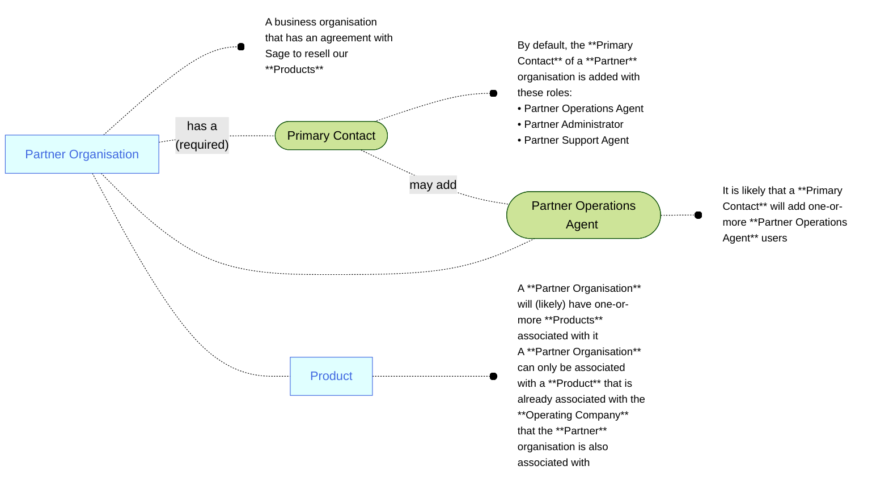

This article is intended for those who need a high-level understanding of what the Sage Provisioning Portal entities are.

```mermaid
%%{
  init: {
    'theme': 'forest',
    'themeVariables': {
      'fontSize':'14pt'
    }
  }
}%%
flowchart LR
  classDef Sage fill:seagreen, color:honeydew;
  classDef Noun fill:lightcyan, stroke:royalblue, color:royalblue;
  classDef Note fill:transparent, stroke:white, text-align:left, font-size: 95%;

  PARTNER_ORGANISATION_01[&nbsp;Partner Organisation&nbsp;]-.-o
  PARTNER_ORGANISATION_01_NOTE[A business organisation that has an agreement with Sage to resell our **Products**]

  PARTNER_ORGANISATION_01[Partner Organisation]-.has a<br/>(required).-
  PRIMARY_CONTACT_01([&nbsp;Primary Contact&nbsp;])-.-o
  PRIMARY_CONTACT_01_NOTE[By default, the **Primary Contact** of a **Partner** organisation is added with these roles:<br/>&bull; Partner Operations Agent<br/>&bull; Partner Administrator<br/>&bull; Partner Support Agent]

  PRIMARY_CONTACT_01-.may add.-
  PARTNER_OPERATIONS_AGENT_01([&nbsp;Partner Operations Agent&nbsp;])-.-o
  PARTNER_OPERATIONS_AGENT_01_NOTE[It is likely that a **Primary Contact** will add one-or-more **Partner Operations Agent** users]

  PARTNER_ORGANISATION_01-.-
  PARTNER_OPERATIONS_AGENT_01

  PARTNER_ORGANISATION_01-.-
  PRODUCT_01["Product"]-.-o
  PRODUCT_01_NOTE["A **Partner Organisation** will (likely) have one-or-more **Products** associated with it<br/>A **Partner Organisation** can only be associated with a **Product** that is already associated with the **Operating Company** that the **Partner** organisation is also associated with"]

  %% ---------- ---------- ---------- ---------- ---------- ---------- ---------- ---------- ---------- ----------
  class PARTNER_ORGANISATION_01,PRODUCT_01 Noun

  class PARTNER_ORGANISATION_01_NOTE,PRIMARY_CONTACT_01_NOTE Note
  class PARTNER_OPERATIONS_AGENT_01_NOTE,PRODUCT_01_NOTE Note
```
