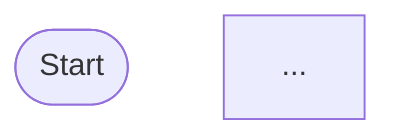

When a **Site** is added, its first user will be added with the **Customer Administrator** role.
Other users will likely be added by that **Customer Administrator** user.
Either way, once you are added as a user of a **Site**:
* You will receive an email invitation with an "access temporary credentials" link
* When you follow that link, you will be required to sign-up / sign-in
* Once signed in, you will be redirected to a page showing your **SPP Hosting** email address, and a 'one time' password

