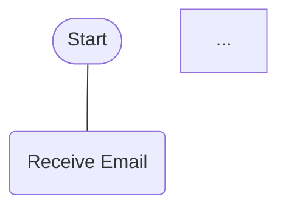
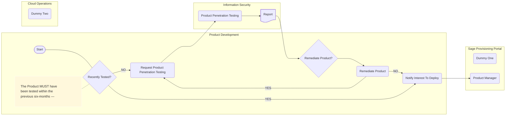

Imagine yourself as an employee of a Customer organisation with a licence to use your Product, and that the Site hosting that Product is **Ready**.
You can sign-in to the Sage Provisioning Portal with your **Customer User** role, but you do not yet have access to the **Site**.

Then, before you do anything, someone in your Customer organisation with the **Customer Administrator** or **Customer Operations Agent** role will assign you to the **Site**.  

## What happens next?
1. You will then receive an 'action required' email with an "access temporary credentials" link  
2. When you follow that link, you will be required to sign-in
3. Once signed-in (with your existing credentials), you will be redirected to a page showing your **SPP Hosting** email address, and a 'one time' password - you will need both to access the **Site**

