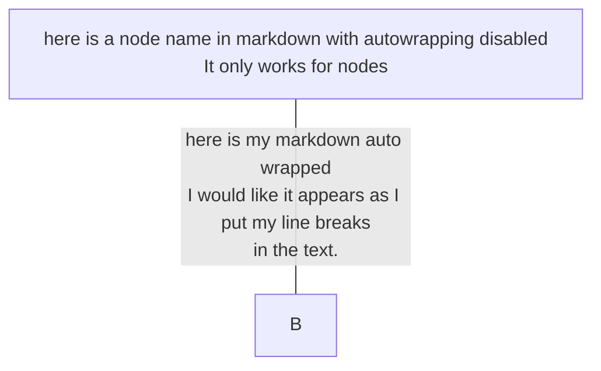

```mermaid
%%{ init: {"theme": "default",
           "themeVariables": { "wrap": "false" },
           "flowchart": { "curve": "linear",
                          "markdownAutoWrap":"false",
                          "wrappingWidth": "600" }
           }
}%%
flowchart

A["`here is a node name in markdown with autowrapping disabled
It only works for nodes`"]

B

A ---|"`here is my markdown auto wrapped
I would like it appears as I put my line breaks
in the text.`"| B

```
