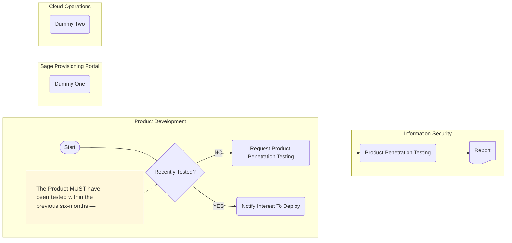
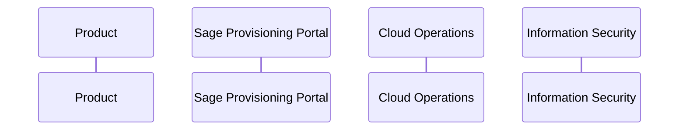

```mermaid
flowchart LR


classDef Note fill:cornsilk, stroke:white, text-align:left, font-size:13pt, width:350px, margin:-5px, padding:150px;
%% ---------- ---------- ---------- ---------- ---------- ---------- ---------- ---------- ---------- ----------
subgraph Product Development
  START@{shape: stadium, label: "Start"}

  RECENTLY_TESTED_NOTE[The Product MUST have been tested within the previous six-months #151;]
  RECENTLY_TESTED{Recently Tested?}


    %%GOBEKLI_TEPE[Göbekli Tepe]
    %%GOBEKLI_TEPE_NOTE[#151; early 'town' in south-eastern Anatolia, founded ~ 9,500 BCE.]
    %%click GOBEKLI_TEPE "https://en.wikipedia.org/wiki/Göbekli_Tepe" _blank


  REQUEST_PRODUCT_PENETRATION_TESTING(Request Product Penetration Testing)
  NOTIFY_INTEREST_TO_DEPLOY(Notify Interest To Deploy)

end


subgraph Sage Provisioning Portal
  DUMMY_ONE(Dummy One)

end

subgraph Cloud Operations
  DUMMY_TWO(Dummy Two)

end

subgraph Information Security
  PRODUCT_PENETRATION_TESTING(Product Penetration Testing)
  PRODUCT_PENETRATION_TESTING_REPORT@{ shape: doc, label: "Report" }

end
  %% ---------- ---------- ---------- ---------- ----------
  %% CONNECTIONS & CLASSES
  %% ---------- ---------- ---------- ---------- ----------
  START---RECENTLY_TESTED
  RECENTLY_TESTED-- NO -->REQUEST_PRODUCT_PENETRATION_TESTING
  RECENTLY_TESTED-- YES -->NOTIFY_INTEREST_TO_DEPLOY


  RECENTLY_TESTED_NOTE-.-RECENTLY_TESTED

  REQUEST_PRODUCT_PENETRATION_TESTING--->PRODUCT_PENETRATION_TESTING--->PRODUCT_PENETRATION_TESTING_REPORT

class RECENTLY_TESTED_NOTE Note
%%YEAR_DOT-.-9500-.-GOBEKLI_TEPE~~~GOBEKLI_TEPE_NOTE


```

```mermaid
sequenceDiagram
    participant Product
    participant Sage Provisioning Portal
    participant Cloud Operations
    participant Information Security

```
