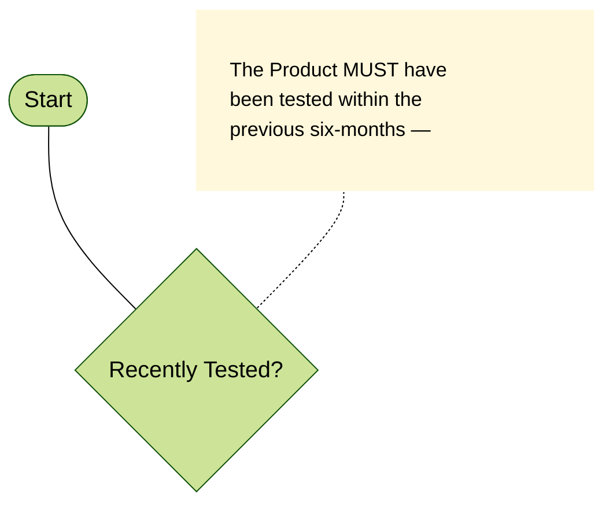

```mermaid
%%{
  init: {
    'theme': 'forest',
    'themeVariables': {
      'fontSize':'15pt'
    }
  }
}%%
flowchart TD


classDef Note fill:cornsilk, stroke:white, text-align:left, font-size:13pt, width:350px, margin:-5px, padding:150px;
%% ---------- ---------- ---------- ---------- ---------- ---------- ---------- ---------- ---------- ----------
  START([Start])

  RECENTLY_TESTED_NOTE[The Product MUST have been tested within the previous six-months #151;]
  RECENTLY_TESTED{Recently Tested?}


    %%GOBEKLI_TEPE[Göbekli Tepe]
    %%GOBEKLI_TEPE_NOTE[#151; early 'town' in south-eastern Anatolia, founded ~ 9,500 BCE.]
    %%click GOBEKLI_TEPE "https://en.wikipedia.org/wiki/Göbekli_Tepe" _blank


  %% ---------- ---------- ---------- ---------- ----------
  %% CONNECTIONS & CLASSES
  %% ---------- ---------- ---------- ---------- ----------
  START---RECENTLY_TESTED
  RECENTLY_TESTED_NOTE-.-RECENTLY_TESTED

class RECENTLY_TESTED_NOTE Note
%%YEAR_DOT-.-9500-.-GOBEKLI_TEPE~~~GOBEKLI_TEPE_NOTE


```
