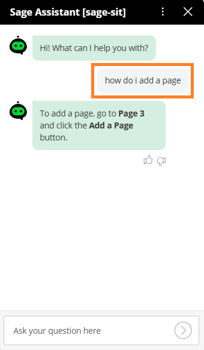
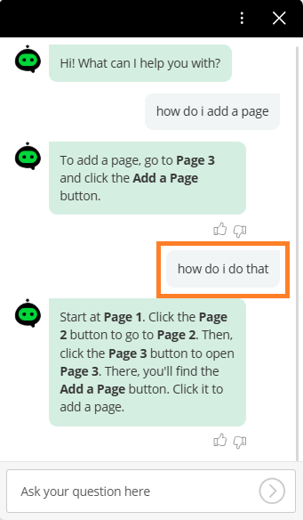

This is a simple demonstration of the capability of the Boost.ai agentic action.

I have created these three 'knowledge articles' about an abstract application named 'Pages': 
- [Page 1](page_1.md)
- [Page 2](page_2.md)
- [Page 3](page_3.md)

The I created an **Intent** with an agentic action that 'knows' about these 'knowledge articles'. 

I then had the conversation with the chatbot shown below.

| how do i add a page | how do i do that |
| - | - |
|||
