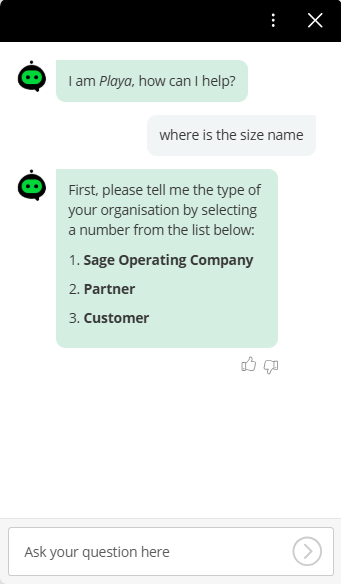
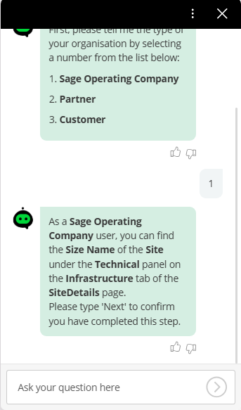
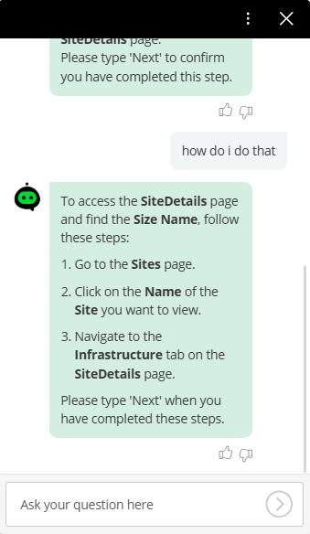
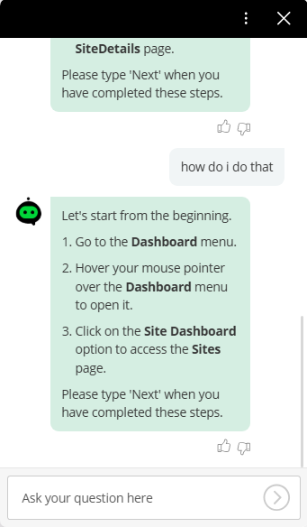
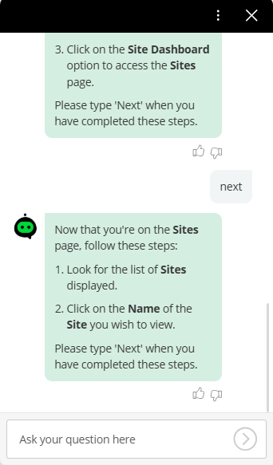
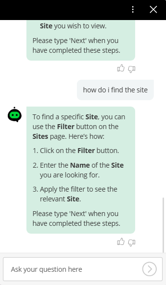
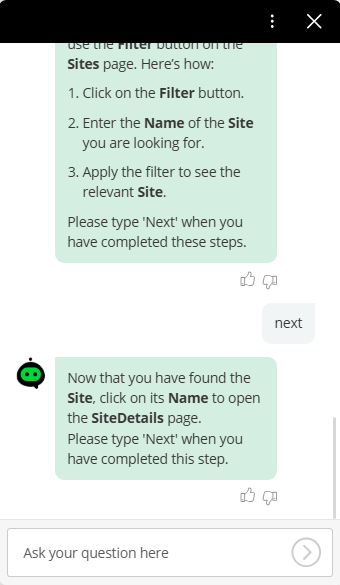
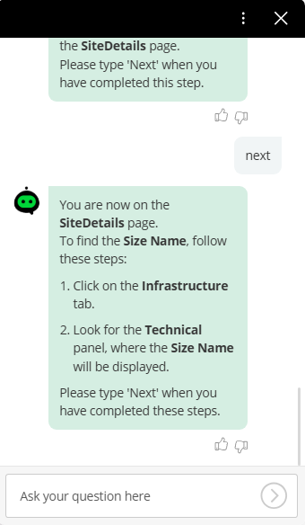
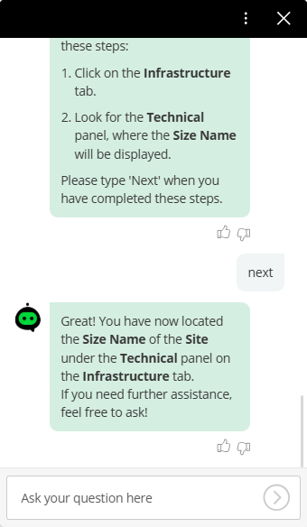

This is a demonstration of the capability of the [Boost.ai](https://boost.ai/) chatbot technology.

The key take-aways are:
1. The only knowledge the chatbot has are the pages (listed below) that describe the user interface at a functional specification level 
2. The chatbot has no literal 'how to' instructions 
3. The chatbot can only generate the conversation (below) by inference  

### Conversation 
| "where is the size name" | "1" | "how do i do that" |
| - | - | - |
||| |
| "how do i do that" | "next" | "how do i find the site" |
||||
| "next" | "next" | "next" |
||||

<!-- --------------- --------------- --------------- --------------- --------------- --------------- --------------- --------------- --------------- -->
**Step 1** - I created these 'knowledge articles' about the application:
- [Types of organisational users](types_of_organisational_users.md)
- [Dashboard menu](dashboard_menu.md)
- [Sites page](sites_page.md)
- [SiteDetails page](sitedetails_page.md)
- [Infrastructure tab](infrastructure_tab.md)

<!-- --------------- --------------- --------------- --------------- --------------- --------------- --------------- --------------- --------------- -->
**Step 2** - I created an **Intent** with an agentic action that 'knows' about these 'knowledge articles', and with these **Local instructions**:
```
# User Experience Rules
Ask the user for the type of their organisation as a numbered list
Only show the user the information that is relevant to their organisational type 
Only show the user one step at a time
Ask the user to type 'Next' after each step to confirm that they have completed the step
```

**Step 3** - I had the conversation (above) with the chatbot
