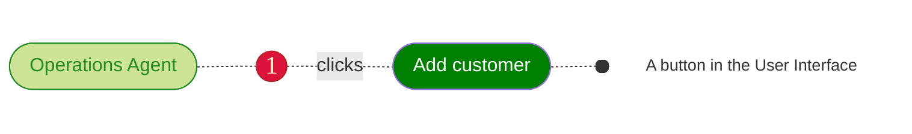

```mermaid
flowchart LR

  %% define styles
  classDef User fill:#cde498, stroke:forestgreen, color:forestgreen;
  classDef Number fill:crimson, color:cornsilk, stroke:firebrick, font-family:verdana, font-size:16pt, padding:10px;
  classDef Button fill:green, color:white;
  classDef Note fill:transparent, stroke:white, text-align:left, font-size: 95%;


  %%classDef Node fill:white, stroke:black, font-size:8pt;
  %%classDef Node fill:white, stroke:black, font-size:8pt;
  %%classDef Sage fill:seagreen, color:honeydew;
  %%classDef Noun fill:lightcyan, stroke:royalblue, color:royalblue;


  OPERATIONS_AGENT_01([&nbsp;Operations Agent&nbsp;]):::User

  %% ---------- ---------- ---------- ---------- ---------- ---------- ---------- ---------- ---------- ----------
  1(("1")):::Number
  ADD_CUSTOMER_01([&nbsp;Add customer&nbsp;]):::Button
  ADD_CUSTOMER_01_NOTE["A button in the User Interface"]:::Note


  OPERATIONS_AGENT_01-.-
  1-.clicks.-
  ADD_CUSTOMER_01-.-o
  ADD_CUSTOMER_01_NOTE
```
