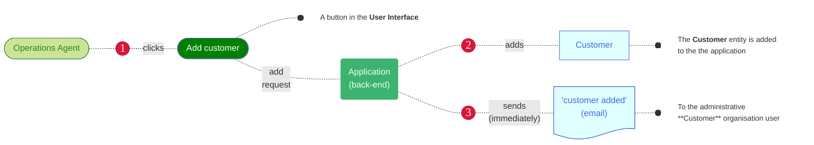

The main advantage of using *mermaid* diagrams in markdown files in GitHub is that, being text-based, *mermaid* diagrams are accessible to artificially inteligent agents.

```mermaid
flowchart LR

  %% define styles
  classDef User fill:#cde498, stroke:forestgreen, color:forestgreen;
  classDef Number fill:crimson, color:cornsilk, stroke:firebrick, font-family:verdana, font-size:16pt, padding:10px;
  classDef Button fill:green, color:white;
  classDef Note fill:transparent, stroke:white, text-align:left, font-size: 95%;

  classDef Backend fill:mediumseagreen, stroke:white, color:honeydew;
  classDef Entity fill:lightcyan, stroke:royalblue, color:royalblue;
  
  %% ---------- ---------- ---------- ---------- ---------- ---------- ---------- ---------- ---------- ----------
  OPERATIONS_AGENT_01([&nbsp;Operations Agent&nbsp;]):::User
  %% ---------- ---------- ---------- ---------- ---------- ---------- ---------- ---------- ---------- ----------
  1(("1")):::Number
  ADD_CUSTOMER_01([&nbsp;Add customer&nbsp;]):::Button
  ADD_CUSTOMER_01_NOTE["A button in the <b>User Interface</b>"]:::Note

  OPERATIONS_AGENT_01-.-
  1-.clicks.-
  ADD_CUSTOMER_01-.-o
  ADD_CUSTOMER_01_NOTE
  %% ---------- ---------- ---------- ---------- ---------- ---------- ---------- ---------- ---------- ----------
  APPLICATION_BACK_END_01("Application<br/>(back-end)"):::Backend

  ADD_CUSTOMER_01-.add<br/>request.-
  APPLICATION_BACK_END_01
  %% ---------- ---------- ---------- ---------- ---------- ---------- ---------- ---------- ---------- ----------
  2(("2")):::Number
  CUSTOMER_01["Customer"]:::Entity
  CUSTOMER_01_NOTE["The <b>Customer</b> entity is added to the the application"]:::Note

  APPLICATION_BACK_END_01-.-
  2-.adds.-
  CUSTOMER_01-.-o
  CUSTOMER_01_NOTE
  %% ---------- ---------- ---------- ---------- ---------- ---------- ---------- ---------- ---------- ----------
  3(("3")):::Number
  CUSTOMER_ADDED_01@{ shape: doc, label: "'customer added'<br/>(email)"}
  CUSTOMER_ADDED_01_NOTE[To the administrative **Customer** organisation user]:::Note

  APPLICATION_BACK_END_01-.-
  3-."sends<br/>(immediately)".-
  CUSTOMER_ADDED_01-.-o
  CUSTOMER_ADDED_01_NOTE

  %% ---------- ---------- ---------- ---------- ---------- ---------- ---------- ---------- ---------- ----------
  %% define classes
  class CUSTOMER_ADDED_01 Entity
```
