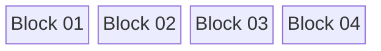
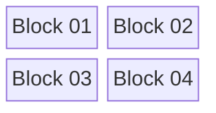
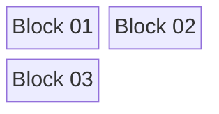
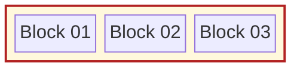

### Four blocks in the same row

```mermaid
  block

    BLOCK_01["Block 01"]
    BLOCK_02["Block 02"]
    BLOCK_03["Block 03"]
    BLOCK_04["Block 04"]
```

### Four blocks - wrapping into two columns

```mermaid
  block
  columns 2

    BLOCK_01["Block 01"]
    BLOCK_02["Block 02"]
    BLOCK_03["Block 03"]
    BLOCK_04["Block 04"]
```

```mermaid
  block
  columns 2

    BLOCK_01["Block 01"]
    BLOCK_02["Block 02"]
    BLOCK_03["Block 03"]
```

```mermaid
  block

  %% define a block with an ID for styling
  block:BLOCK_A
    BLOCK_01["Block 01"]
    BLOCK_02["Block 02"]
    BLOCK_03["Block 03"]
  end

  %% define styles
  style BLOCK_A fill:cornsilk,stroke:firebrick,stroke-width:2px
```

