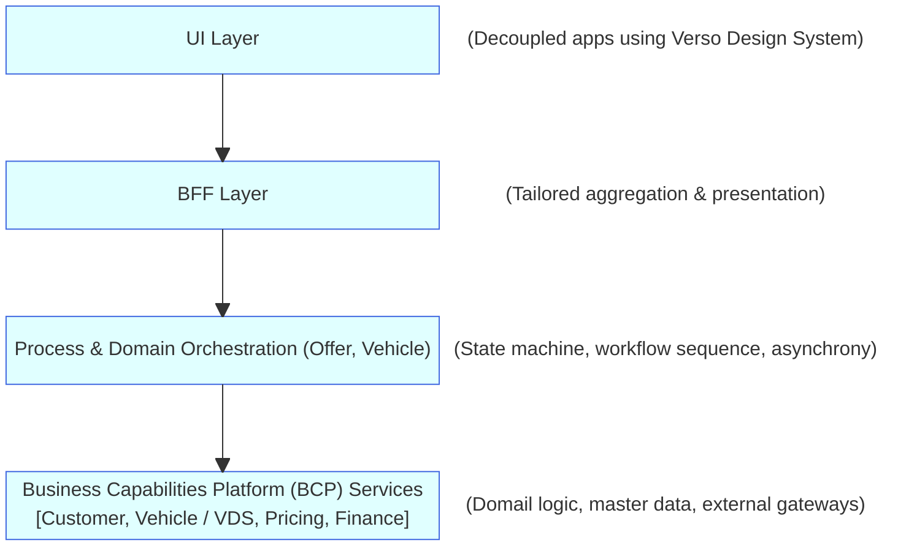

```mermaid
  block
  columns 2

  %% ---------- ---------- ---------- ---------- ---------- ---------- ---------- ---------- ---------- ----------
    BLOCK_01["UI Layer"]:1
    BLOCK_01_NOTE["(Decoupled apps using Verso Design System)"]
    space:2
  %% ---------- ---------- ---------- ---------- ---------- ---------- ---------- ---------- ---------- ----------
    BLOCK_02["BFF Layer"]:1
    BLOCK_02_NOTE["(Tailored aggregation &amp; presentation)"]
    space:2
  %% ---------- ---------- ---------- ---------- ---------- ---------- ---------- ---------- ---------- ----------
    BLOCK_03["Process &amp; Domain Orchestration (Offer, Vehicle)"]:1
    BLOCK_03_NOTE["(State machine, workflow sequence, asynchrony)"]
    space:2
  %% ---------- ---------- ---------- ---------- ---------- ---------- ---------- ---------- ---------- ----------
    BLOCK_04["Business Capabilities Platform (BCP) Services<br/>[Customer, Vehicle / VDS, Pricing, Finance]"]:1
    BLOCK_04_NOTE["(Domail logic, master data, external gateways)"]
  %% ---------- ---------- ---------- ---------- ---------- ---------- ---------- ---------- ---------- ----------
  %% define connections
  BLOCK_01-->
  BLOCK_02

  BLOCK_02-->
  BLOCK_03

  BLOCK_03-->
  BLOCK_04
  %% ---------- ---------- ---------- ---------- ---------- ---------- ---------- ---------- ---------- ----------
  %% define styles
  style BLOCK_01 fill:lightcyan, stroke:royalblue, color:royalblue;
  style BLOCK_02 fill:lightcyan, stroke:royalblue, color:royalblue;
  style BLOCK_03 fill:lightcyan, stroke:royalblue, color:royalblue;
  style BLOCK_04 fill:lightcyan, stroke:royalblue, color:royalblue;

  style BLOCK_01_NOTE fill:transparent, stroke:white, text-align:left;
  style BLOCK_02_NOTE fill:transparent, stroke:white, text-align:left;
  style BLOCK_03_NOTE fill:transparent, stroke:white, text-align:left;
  style BLOCK_04_NOTE fill:transparent, stroke:white, text-align:left;

```
