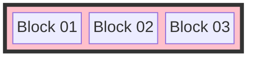
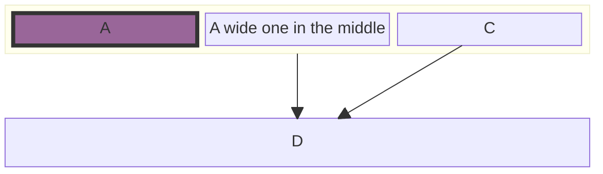

```mermaid
  block
  columns 2

  block:A1
    BLOCK_01["Block 01"]
    BLOCK_02["Block 02"]
    BLOCK_03["Block 03"]
  end

  style A1 fill:pink,stroke:#333,stroke-width:4px

```

----

```mermaid

block
columns 1

  block:ID
    A
    B["A wide one in the middle"]
    C
  end

  space
  D
  ID --> D
  C --> D
  style A fill:#969,stroke:#333,stroke-width:4px

```
