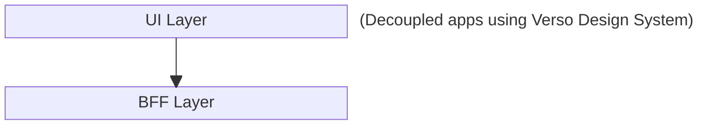

```mermaid
  block

  %% define styles
  %%classDef Button fill:lightcyan, stroke:royalblue, color:royalblue;
  %%classDef Note fill:transparent, stroke:white, text-align:left;


    columns 2
    BLOCK_01["UI Layer"]:1
    BLOCK_01_NOTE["(Decoupled apps using Verso Design System)"]


  space:2
    BLOCK_02["BFF Layer"]:1

BLOCK_01-->BLOCK_02

    %%NOTE_01["Note 01"]:2

  style BLOCK_01_NOTE fill:transparent, stroke:white, text-align:left;
```
