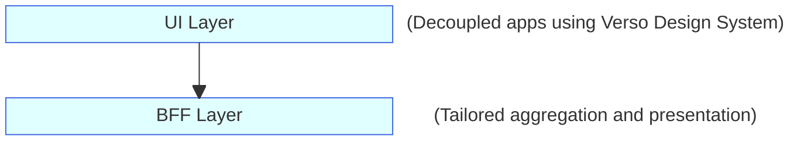

```mermaid
  block
  columns 2

  %% ---------- ---------- ---------- ---------- ---------- ---------- ---------- ---------- ---------- ----------
    BLOCK_01["UI Layer"]:1
    BLOCK_01_NOTE["(Decoupled apps using Verso Design System)"]
    space:2
  %% ---------- ---------- ---------- ---------- ---------- ---------- ---------- ---------- ---------- ----------
    BLOCK_02["BFF Layer"]:1
    BLOCK_02_NOTE["(Tailored aggregation and presentation)"]
  %% ---------- ---------- ---------- ---------- ---------- ---------- ---------- ---------- ---------- ----------


    BLOCK_01-->BLOCK_02


  %% ---------- ---------- ---------- ---------- ---------- ---------- ---------- ---------- ---------- ----------
  %% define styles
  style BLOCK_01 fill:lightcyan, stroke:royalblue, color:royalblue;
  style BLOCK_02 fill:lightcyan, stroke:royalblue, color:royalblue;

  style BLOCK_01_NOTE fill:transparent, stroke:white, text-align:left;
  style BLOCK_02_NOTE fill:transparent, stroke:white, text-align:left;

```
