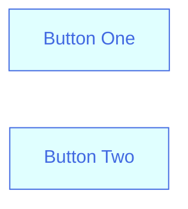

```mermaid
%%{
  init: {
    "flowchart": { "markdownAutoWrap":"false", "textWrap":"false", "wrappingWidth": "100%" }
  }
}%%
flowchart LR

  %% define styles
  classDef User fill:#cde498, stroke:forestgreen, color:forestgreen;
  classDef Number fill:crimson, color:cornsilk, stroke:firebrick, font-family:verdana, font-size:16pt, padding:10px;
  classDef Button fill:lightcyan, stroke:royalblue, color:royalblue;
  %% ---------- ---------- ---------- ---------- ---------- ---------- ---------- ---------- ---------- ----------
  BUTTON_ONE[Button One]:::Button
  click BUTTON_ONE "https://en.wikipedia.org/wiki/Main_Page" _blank
  %% ---------- ---------- ---------- ---------- ---------- ---------- ---------- ---------- ---------- ----------
  BUTTON_TWO[Button Two]:::Button
  click BUTTON_TWO "[https://en.wikipedia.org/wiki/Main_Page](https://www.hastings.gov.uk/coastlinebeaches/tidetables/)" _blank
```

Button One

