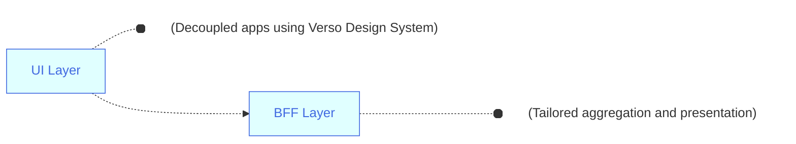
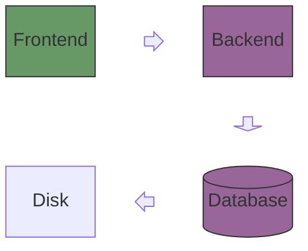

Some text...

```mermaid
  %%{
    init: {"flowchart": { "markdownAutoWrap":"false", "textWrap":"false", "wrappingWidth": "100%" }
    }
  }%%
  flowchart LR

  %% define styles
  classDef Button fill:lightcyan, stroke:royalblue, color:royalblue;
  classDef Note fill:transparent, stroke:white, text-align:left;
  %% ---------- ---------- ---------- ---------- ---------- ---------- ---------- ---------- ---------- ----------
  BUTTON_01[UI Layer]:::Button
  click BUTTON_01 "https://en.wikipedia.org/wiki/Main_Page" _blank
  BUTTON_01_NOTE["(Decoupled apps using Verso Design System)"]:::Note

  %% connect button to note
  BUTTON_01-.-o
  BUTTON_01_NOTE
  %% ---------- ---------- ---------- ---------- ---------- ---------- ---------- ---------- ---------- ----------
  BUTTON_02[BFF Layer]:::Button
  click BUTTON_02 "https://en.wikipedia.org/wiki/Main_Page" _blank
  BUTTON_02_NOTE["(Tailored aggregation and presentation)"]:::Note

  %% connect button to note
  BUTTON_02-.-o
  BUTTON_02_NOTE
  %% ---------- ---------- ---------- ---------- ---------- ---------- ---------- ---------- ---------- ----------


  %% ---------- ---------- ---------- ---------- ---------- ---------- ---------- ---------- ---------- ----------

  %% connect buttons to buttons
  BUTTON_01-.->
  BUTTON_02
```

More text...

```mermaid
block
  columns 3
  Frontend blockArrowId6<[" "]>(right) Backend
  space:2 down<[" "]>(down)
  Disk left<[" "]>(left) Database[("Database")]

  classDef front fill:#696,stroke:#333;
  classDef back fill:#969,stroke:#333;
  class Frontend front
  class Backend,Database back
```
