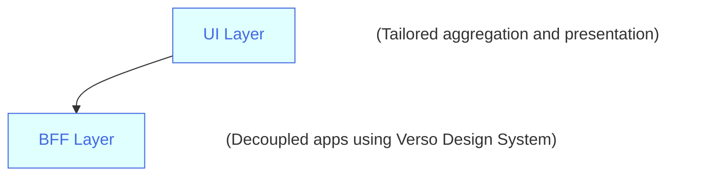

Some text...

```mermaid
  %%{
    init: {"flowchart": { "markdownAutoWrap":"false", "textWrap":"false", "wrappingWidth": "100%" }
    }
  }%%
  flowchart TD

  %% define styles
  classDef Button fill:lightcyan, stroke:royalblue, color:royalblue;
  classDef Note fill:transparent, stroke:white, text-align:left;
  %% ---------- ---------- ---------- ---------- ---------- ---------- ---------- ---------- ---------- ----------

    BUTTON_01[UI Layer]:::Button
    click BUTTON_01 "https://en.wikipedia.org/wiki/Main_Page" _blank
    BUTTON_01_NOTE["(Decoupled apps using Verso Design System)"]:::Note
  
    %% connect button to note
    %%BUTTON_01-.-o
    %%BUTTON_01_NOTE

  %% ---------- ---------- ---------- ---------- ---------- ---------- ---------- ---------- ---------- ----------

    BUTTON_02[BFF Layer]:::Button
    click BUTTON_02 "https://en.wikipedia.org/wiki/Main_Page" _blank
    BUTTON_02_NOTE["(Tailored aggregation and presentation)"]:::Note
  
    %% connect button to note
    %%BUTTON_02-.-o
    %%BUTTON_02_NOTE
 
  %% ---------- ---------- ---------- ---------- ---------- ---------- ---------- ---------- ---------- ----------
  BUTTON_01-->BUTTON_02

  BUTTON_01~~~
  BUTTON_01_NOTE

```

More text...

