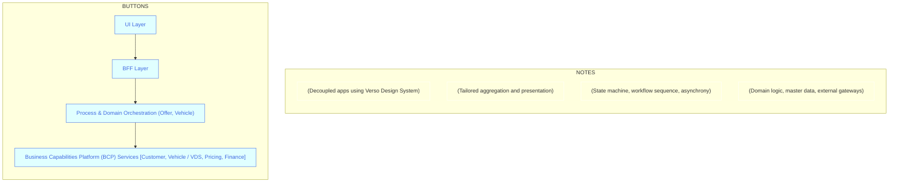

Some text...

```mermaid
  %%{
    init: {"flowchart": { "markdownAutoWrap":"false", "textWrap":"false", "wrappingWidth": "100%" }
    }
  }%%
  flowchart LR

  %% define styles
  classDef SubGraph fill:pink, text-align:left;

  classDef Button fill:lightcyan, stroke:royalblue, color:royalblue, text-align:left;
  classDef Note fill:transparent, stroke:white, text-align:left;
  %% ---------- ---------- ---------- ---------- ---------- ---------- ---------- ---------- ---------- ----------
  subgraph BUTTONS
    direction TD

    BUTTON_01["UI Layer"]:::Button
    click BUTTON_01 "https://en.wikipedia.org/wiki/Main_Page" _blank

    BUTTON_02["BFF Layer"]:::Button
    click BUTTON_02 "https://en.wikipedia.org/wiki/Main_Page" _blank

    BUTTON_03["Process & Domain Orchestration (Offer, Vehicle)"]:::Button
    click BUTTON_03 "https://en.wikipedia.org/wiki/Main_Page" _blank

    BUTTON_04["Business Capabilities Platform (BCP) Services [Customer, Vehicle / VDS, Pricing, Finance]"]:::Button
    click BUTTON_04 "https://en.wikipedia.org/wiki/Main_Page" _blank
  end
  %% ---------- ---------- ---------- ---------- ---------- ---------- ---------- ---------- ---------- ----------
  subgraph NOTES
    direction TD
    BUTTON_01_NOTE["(Decoupled apps using Verso Design System)"]:::Note
    BUTTON_02_NOTE["(Tailored aggregation and presentation)"]:::Note
    BUTTON_03_NOTE["(State machine, workflow sequence, asynchrony)"]:::Note
    BUTTON_04_NOTE["(Domain logic, master data, external gateways)"]:::Note
  end
  %% ---------- ---------- ---------- ---------- ---------- ---------- ---------- ---------- ---------- ----------
  %% invisibly connect BUTTONS (sub-graph) to NOTES (sub-graph)
  BUTTONS~~~
  NOTES
  %% ---------- ---------- ---------- ---------- ---------- ---------- ---------- ---------- ---------- ----------
  %% connect buttons
  BUTTON_01-->
  BUTTON_02-->
  BUTTON_03-->
  BUTTON_04
  %% ---------- ---------- ---------- ---------- ---------- ---------- ---------- ---------- ---------- ----------
```

More text...

