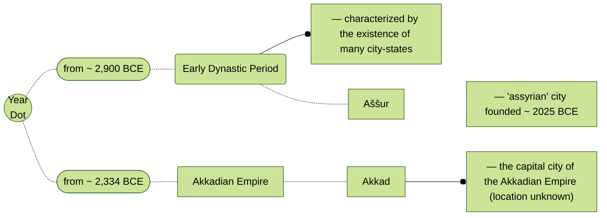
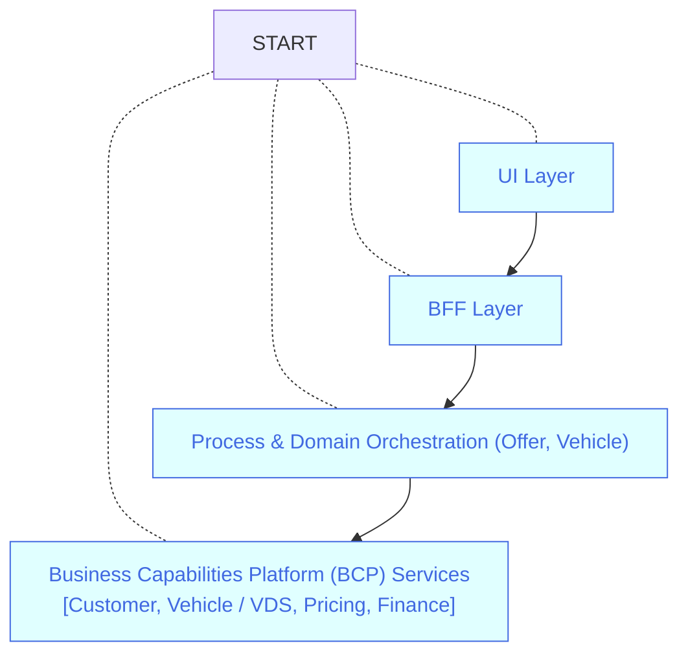
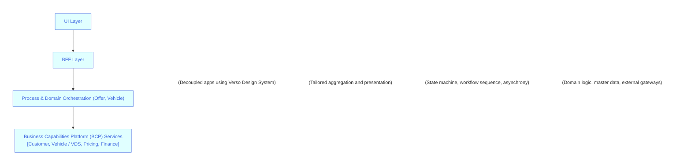

```mermaid
%%{
  init: {
    'theme': 'forest',
    'themeVariables': {
      'fontSize':'15pt'
    }
  }
}%%
flowchart LR

%%classDef Node fill:cornsilk, stroke:saddlebrown, color:saddlebrown, line-height:150%, margin:0px, padding:0px;
classDef Note fill:white, stroke:white, text-align:left, font-size:13pt, width:350px, margin:-5px, padding:150px  ;
%% ---------- ---------- ---------- ---------- ---------- ---------- ---------- ---------- ---------- ----------
  YEAR_DOT(("Year<br>Dot"))

  2900([from ~ 2,900 BCE])
    EARLY_DYNASTIC_PERIOD(Early Dynastic Period)
    click EARLY_DYNASTIC_PERIOD "https://en.wikipedia.org/wiki/Early_Dynastic_Period_(Mesopotamia)" _blank
    EARLY_DYNASTIC_PERIOD_NOTE[#151; characterized by the existence of many city-states]

    ASSUR_01[Aššur]
    ASSUR_01_NOTE[#151; 'assyrian' city founded ~ 2025 BCE]
    click ASSUR_01 "https://en.wikipedia.org/wiki/Assur" _blank


  2334([from ~ 2,334 BCE])
    AKKADIAN_EMPIRE[Akkadian Empire]
    click AKKADIAN_EMPIRE "https://en.wikipedia.org/wiki/Akkadian_Empire" _blank

    AKKAD[Akkad]
    AKKAD_NOTE["#151; the capital city of the Akkadian Empire (location unknown)"]


  YEAR_DOT-.-2900-.-EARLY_DYNASTIC_PERIOD--oEARLY_DYNASTIC_PERIOD_NOTE
                    EARLY_DYNASTIC_PERIOD-.-ASSUR_01~~~ASSUR_01_NOTE

  YEAR_DOT-.-2334-.-AKKADIAN_EMPIRE
                    AKKADIAN_EMPIRE-.-AKKAD--oAKKAD_NOTE
```

```mermaid
  %%{
    init: {
      "flowchart": { "markdownAutoWrap":"false", "textWrap":"false", "wrappingWidth": "100%" }
    }
  }%%
  flowchart TD

  classDef Button fill:lightcyan, stroke:royalblue, color:royalblue;
  classDef Note fill:transparent, stroke-width:0px
  %% ---------- ---------- ---------- ---------- ---------- ---------- ---------- ---------- ---------- ----------
  START[START]

    BUTTON_01["UI Layer"]:::Button
    click BUTTON_01 "https://en.wikipedia.org/wiki/Main_Page" _blank

    BUTTON_02["BFF Layer"]:::Button
    click BUTTON_02 "https://en.wikipedia.org/wiki/Main_Page" _blank

    BUTTON_03["Process & Domain Orchestration (Offer, Vehicle)"]:::Button
    click BUTTON_03 "https://en.wikipedia.org/wiki/Main_Page" _blank

    BUTTON_04["Business Capabilities Platform (BCP) Services<br/>[Customer, Vehicle / VDS, Pricing, Finance]"]:::Button
    click BUTTON_04 "https://en.wikipedia.org/wiki/Main_Page" _blank

  START-.-
  BUTTON_01

  START-.-
  BUTTON_02

  START-.-
  BUTTON_03

  START-.-
  BUTTON_04

BUTTON_01-->BUTTON_02-->BUTTON_03-->BUTTON_04

```

Some text...

```mermaid
  %%{
    init: {
      "flowchart": { "markdownAutoWrap":"false", "textWrap":"false", "wrappingWidth": "100%" }
    }
  }%%
  flowchart LR

  classDef Button fill:lightcyan, stroke:royalblue, color:royalblue;
  classDef Note fill:transparent, stroke-width:0px
  %% ---------- ---------- ---------- ---------- ---------- ---------- ---------- ---------- ---------- ----------
  subgraph BUTTONS
    direction TD

    BUTTON_01["UI Layer"]:::Button
    click BUTTON_01 "https://en.wikipedia.org/wiki/Main_Page" _blank

    BUTTON_02["BFF Layer"]:::Button
    click BUTTON_02 "https://en.wikipedia.org/wiki/Main_Page" _blank

    BUTTON_03["Process & Domain Orchestration (Offer, Vehicle)"]:::Button
    click BUTTON_03 "https://en.wikipedia.org/wiki/Main_Page" _blank

    BUTTON_04["Business Capabilities Platform (BCP) Services<br/>[Customer, Vehicle / VDS, Pricing, Finance]"]:::Button
    click BUTTON_04 "https://en.wikipedia.org/wiki/Main_Page" _blank
  end

  %% ---------- ---------- ---------- ---------- ---------- ---------- ---------- ---------- ---------- ----------
  subgraph NOTES
    direction TD
    BUTTON_01_NOTE["(Decoupled apps using Verso Design System)"]:::Note
    BUTTON_02_NOTE["(Tailored aggregation and presentation)"]:::Note
    BUTTON_03_NOTE["(State machine, workflow sequence, asynchrony)"]:::Note
    BUTTON_04_NOTE["(Domain logic, master data, external gateways)"]:::Note
  end
  %% ---------- ---------- ---------- ---------- ---------- ---------- ---------- ---------- ---------- ----------
  %% invisibly connect BUTTONS (sub-graph) to NOTES (sub-graph)
  BUTTONS~~~
  NOTES
  %% ---------- ---------- ---------- ---------- ---------- ---------- ---------- ---------- ---------- ----------
  %% connect buttons
  BUTTON_01-->
  BUTTON_02-->
  BUTTON_03-->
  BUTTON_04
  %% ---------- ---------- ---------- ---------- ---------- ---------- ---------- ---------- ---------- ----------
  style BUTTONS fill:transparent,color:white,stroke-width:0px
  style NOTES fill:transparent,color:white,stroke-width:0px
  style BUTTON_04_NOTE height:75px;
```

More text...

